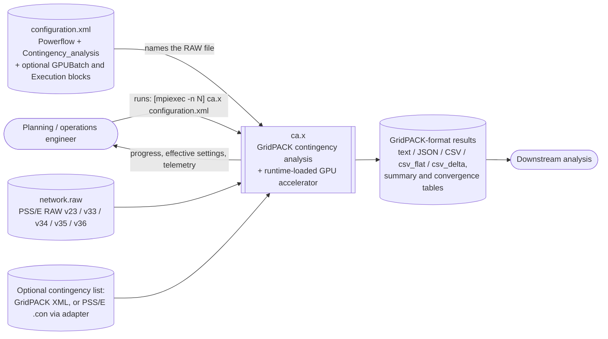
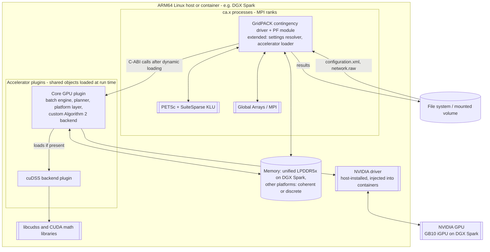
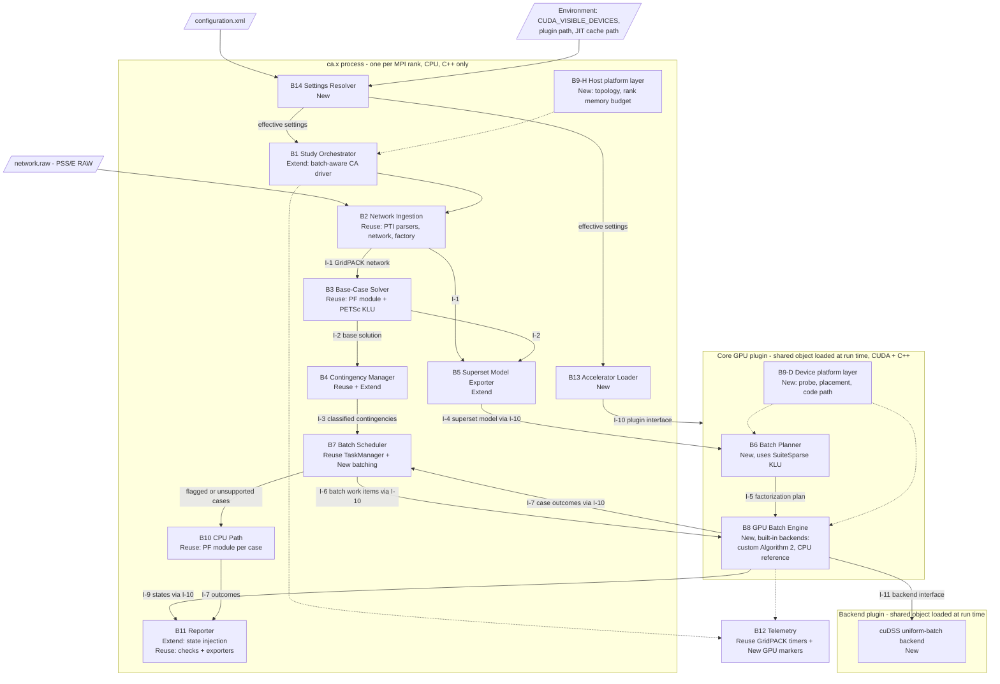
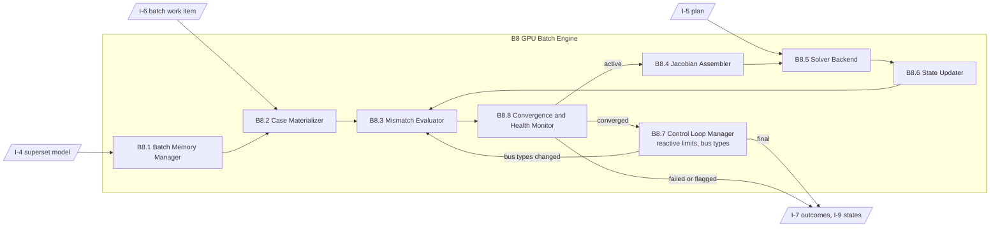
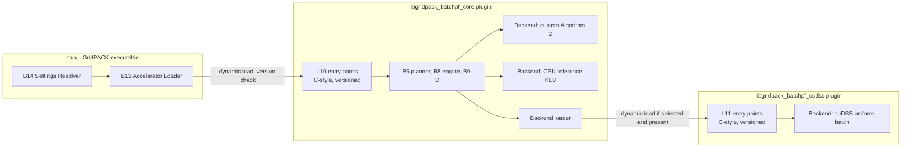

# Architecture Guide: GridPACK-Based GPU N-1 AC Contingency Analysis for ARM + NVIDIA Platforms

**GridPACK as the host framework; hybrid KLU + AMD planning (D'Orto et al., 2021) plus GPU batch LU refactorization (Zhou et al., 2017) as a runtime-loaded accelerator. Primary target: NVIDIA DGX Spark (GB10). Minimum target: any ARM CPU + NVIDIA GPU + Linux system. User entry point unchanged: `ca.x configuration.xml`.**

| Item | Value |
|---|---|
| Document type | Software architecture description (arc42 structure, C4-style diagrams, docs-as-code) |
| Status | Draft for review. Design proposal, not yet implemented or benchmarked |
| Version | 0.3 (supersedes 0.2) |
| Date | 2026-10-05 |
| Intended readers | Software architects, numerical/HPC developers, GridPACK developers, power-systems engineers, test engineers, platform and DevOps engineers |
| Scope | Steady-state AC N-1 contingency analysis of large transmission grids supplied as PSS/E RAW files, on ARM + NVIDIA + Linux platforms, built and run in containers the way GridPACK is today |

### Change Log (0.2 → 0.3)

| # | Change | Main sections |
|---|---|---|
| 1 | **Engineering standards with a defined exception policy.** All C++ follows the C++ Core Guidelines [CG]; all CUDA follows the CUDA C++ Best Practices Guide [CUDA-BP]; all Dockerfile changes follow the Dockerfile reference [DF]; all CMake changes follow *Effective Modern CMake* [EMC]. Each standard has a narrow, recorded exception rule. | 2.5, 8.17–8.21, Appendix F |
| 2 | **Runtime-first configuration.** Every decision that can be made at run time is a setting in `configuration.xml`, an environment variable, or automatic detection, never a compile-time switch. The few unavoidable build-time decisions are listed with their reasons. | 2.6, 8.16, Appendix G |
| 3 | **Runtime-loaded accelerator.** The GPU code is built as plugins that `ca.x` loads at run time. The same `ca.x` binary runs with or without a GPU, driver, or cuDSS, and falls back to GridPACK's CPU path when any is missing. | 4, 5, 6.0, ADR-16 |
| 4 | **Unchanged user entry point.** Users run `ca.x configuration.xml`, optionally under `mpiexec`, exactly as with stock GridPACK. The RAW file is named inside the XML. No new executables or required arguments. | 1.2, 3, 6.0, ADR-17 |
| 5 | **Container build like GridPACK's.** The existing Dockerfile gains build arguments so the same file builds the GPU-enabled image; its default build is unchanged. | 7.3, 8.20, ADR-20 |
| 6 | **CMake integration plan** using targets, imported dependency targets, a subdirectory that enables CUDA only when a compiler is present, and static analysis through CMake's analyzer properties. | 7.3, 8.19, ADR-21 |
| 7 | GridPACK's compile-time `LARGE_MATRIX` option becomes a proposed runtime selection (extension E6). | 8.3, ADR-22, Appendix C |

### Change Log (0.1 → 0.2) — history

| # | Change | Main sections |
|---|---|---|
| 1 | **GridPACK-first.** GridPACK's parsers, network, factory and mapper, power-flow module, contingency-analysis driver, task manager, configuration, results exporter, build stack, and Docker images are reused wherever possible. New code is limited to the GPU batch engine, a batch planner, a platform abstraction layer, and small, upstreamable GridPACK extensions. | 4, 5, Appendix C |
| 2 | **PSS/E RAW is the primary input**, read through GridPACK's version-specific parsers (v23, v33, v34, v35, v36, with header auto-detection). MATPOWER is no longer a requirement. | 1.2, 3, 8.1 |
| 3 | **Primary deployment target is the NVIDIA DGX Spark** (GB10 Grace Blackwell, 10 Cortex-X925 + 10 Cortex-A725 cores, 128 GB coherent unified LPDDR5x at 273 GB/s, DGX OS 8). | 2.4, 7, 8.7–8.9 |
| 4 | **Portability to any ARM CPU + NVIDIA GPU + Linux system** through runtime capability detection, a memory-placement policy covering unified, coherent, and discrete memory systems, multi-architecture builds, and CPU-topology-aware placement. | 2.4, 7.3, 8.8, 8.9 |
| 5 | **Superset Jacobian pattern.** Derived from GridPACK's existing (compile-time optional) `LARGE_MATRIX` formulation, it lets bus-type changes, slack transfer, reactive-limit switching, and island isolation stay inside the GPU batch as value changes. Version 0.1 had routed these cases to the CPU. | 4, 8.3, ADR-08 |
| 6 | **The CPU path is GridPACK itself.** The stock contingency-analysis driver, or its power-flow module, solves fallback cases. Results and reports use GridPACK's own violation checks and exporters. | 5, 6 |
| 7 | New and revised decisions, risks, and quality scenarios. | 9, 10, 11 |

---

## 0. About This Document

### 0.1 Purpose

This guide describes the architecture of a solver that runs every single-outage ("N-1") case of a large power grid through a full AC power flow as fast as possible on ARM + NVIDIA hardware, with the DGX Spark as the reference machine.

Two published techniques supply the acceleration:
1. **The KLU + AMD hybrid CPU/GPU Newton-Raphson power flow** of D'Orto et al. [D]: plan the sparse linear algebra once on the CPU, then refactorize on the GPU.
2. **The GPU batch LU-factorization solver** of Zhou et al. [Z] ("Algorithm 2"): factorize many same-structure systems at once on the GPU.

**GridPACK** [GPK] supplies everything else:
- PSS/E RAW parsing;
- the network data model and the power-flow formulation;
- base-case solution;
- contingency generation and semantics (slack transfer, island detection, limit checks);
- task distribution;
- configuration and output formats;
- the build stack.

The guide is self-contained. Each technique taken from a source is described completely enough to understand the design without the source, and is cited for traceability. Appendices A and B describe the two reference methods in full. Appendix C inventories every GridPACK artifact the design reuses.

The guide aims to be detailed enough to draw context, container, component, runtime, and deployment diagrams, while leaving data structures, kernels, and code organization to implementers. Where it constrains implementation, it uses **MUST**, **SHOULD**, and **MAY**.

### 0.2 Evidence Conventions

For physics, power-systems engineering, and modeling, the order of authority is: the Kundur excerpt first, research papers second, other online sources last. For software behavior, the order is: GridPACK source code and documentation first, vendor documentation second, third-party reports last. For coding, build, and container practice, the four normative standards of Section 2.5 apply.

| Tag | Meaning |
|---|---|
| **[K §x]** | Kundur & Malik, *Power System Stability and Control*, 2nd ed., Section 6.4. Primary authority for physics and modeling. |
| **[G]** | Grigsby (ed.), *Power System Stability and Control*, 2012, Ch. 23: security definitions. |
| **[D]**, **[Z]** | The two reference papers (Appendices A and B). |
| **[Z16], [W21], [EX]** | Supporting research papers. |
| **[GPK], [GPK-CA], [GPK-PF], [GPK-YM], [GPK-MATH], [GPK-PAR]** | GridPACK repository, develop branch: README/Dockerfile/dependency script; contingency-analysis application; power-flow module and components; Y-matrix components; PETSc math wrappers; parallel task manager. Read directly from source during preparation of this guide. |
| **[PETSC]** | PETSc documentation (KLU interface, solver types). |
| **[SPK-HW], [SPK-PG], [SPK-RN], [DGXOS8]** | NVIDIA DGX Spark hardware overview and user guide; DGX Spark Porting Guide; DGX Spark release notes; DGX OS 8 user guide. |
| **[CUDA-UM], [CUDA-RN], [TEGRA]** | CUDA Programming Guide (unified and system memory); CUDA Toolkit release notes; CUDA for Tegra application note. |
| **[NV-RF], [NV-DSS], [NV-F]** | cuSOLVER/cuSolverRF docs; cuDSS docs and release notes; NVIDIA developer forum report. |
| **[SR], [KS], [CT], [OGKM], [GS]** | Third-party reports (StorageReview, Kubesimplify, CpuTronic, NVIDIA open-gpu-kernel-modules issue tracker, GPUSmith). Lowest authority; used only where vendor documentation is silent. |
| **[GP], [SPP], [GPS], [QT], [UG]** | GridPACK contingency README (as in v0.1); SPP planning criteria; GPU contingency-screening paper; architecture-documentation guides. |
| **[CG]** | *C++ Core Guidelines*, Stroustrup & Sutter (eds.), version of Jun 14, 2026. Rules cited by identifier, e.g. [CG R.1]. Normative for all C++ (Section 2.5). |
| **[CUDA-BP]** | NVIDIA *CUDA C++ Best Practices Guide*, Release 13.4 (Sep 15, 2026). Cited by section, e.g. [CUDA-BP §17.1]. Normative for all CUDA code (Section 2.5). |
| **[DF]** | *Dockerfile reference* (Docker documentation, supplied as `dockerfile.md`). Normative for all Dockerfile changes (Section 2.5). |
| **[EMC]** | *Effective Modern CMake* (supplied as `effective_modern_cmake.md`). Cited by its rule headings. Normative for all CMake changes (Section 2.5). |
| **[CMAKE], [CUDA-IG], [NV-IMG]** | CMake reference documentation; NVIDIA CUDA Installation Guide for Linux; NVIDIA CUDA container image listings (Docker Hub, NGC). |
| **[CRS], [ULT]** | Third-party sources on cuDSS packaging (ceres-solver issue) and CDI device requests on DGX Spark (Ultralytics guide). |
| **[P]** | **Design proposal or engineering inference** made in this guide. Not validated by any source; must be confirmed by prototyping or benchmarking. |

### 0.3 How to Read This Guide

- **Chapters 1–3:** requirements, quality goals, constraints (including the platform contract), and system boundaries.
- **Chapter 4:** the strategy in one page, including the GridPACK-first principle.
- **Chapters 5–7:** building blocks (each labeled *Reuse*, *Extend*, or *New* relative to GridPACK), runtime scenarios, and deployment on DGX Spark and other ARM + NVIDIA systems.
- **Chapter 8:** cross-cutting concepts, including physics, numerics, the superset pattern, memory and platform policy, GridPACK parity, runtime configuration, and the C++, CUDA, CMake, and Docker standards (8.16–8.21).
- **Chapters 9–12:** decisions, quality scenarios, risks, and glossary.
- **Appendices A–B:** the reference methods. **Appendix C:** GridPACK reuse inventory. **Appendix D:** platform reference data. **Appendix E:** supporting sources. **Appendix F:** standards compliance matrix and exception register. **Appendix G:** runtime settings reference.

Readers new to power systems should read Sections 8.1–8.2 first.

### 0.4 Document Governance

This guide is a living document [QT]:
- It SHOULD be version-controlled with the solver code.
- It SHOULD be reviewed at each release and whenever a Chapter 9 decision changes.
- Every **[P]** item SHOULD be converted to a measured or sourced statement, or removed.
- Diagrams are Mermaid text, so they can be reviewed like code [UG].

Because the design depends on fast-moving platform software (DGX OS, CUDA 13.x, cuDSS), the platform data in Section 2.4 and Appendix D MUST be re-verified at each release. The normative standards are pinned to the editions cited here (*C++ Core Guidelines* of June 14, 2026; *CUDA C++ Best Practices Guide* 13.4); moving to a newer edition is reviewed like a dependency upgrade, including a pass over the Appendix F register.

---

## 1. Introduction and Goals

### 1.1 Problem Statement

A transmission grid is planned and operated so that it stays within limits even if any single major element fails. This is the **N-1 criterion**: in a secure system, all load is supplied and no limit violations occur in any credible contingency [G][SPP]. Checking it means solving one full AC power flow for every credible single outage and comparing the resulting loadings and voltages against limits [SPP][GP]. For grids with tens of thousands of buses, this means thousands to tens of thousands of nonlinear power flows per study [K §6.4.3][D].

**GridPACK already performs N-1 contingency analysis.** Its contingency-analysis application:
- reads PSS/E RAW files;
- auto-generates all branch and generator outages;
- transfers the slack when needed and detects islands;
- checks violations and writes CSV/JSON results.

It runs each contingency as a separate CPU power flow on one MPI rank, distributed by a dynamic task manager [GPK-CA].

**What this design adds** is a GPU batch path for the bulk of the cases, motivated by two observations:
1. **One power flow is too small for a GPU.** A power-flow Jacobian, typically under 100,000 rows, leaves most of a GPU idle when factorized alone [Z]. GPU factorization throughput rises steeply with problem size [D].
2. **The equation structure barely changes between cases.** The Jacobian's nonzero positions are identical across Newton iterations [D], and can be made identical across outage cases by keeping removed elements as explicit zeros [Z]. Structural planning can then be done once.

### 1.2 Requirements Overview

| ID | Functional requirement |
|---|---|
| FR-1 | Ingest transmission networks from **PSS/E RAW** files, versions 23, 33, 34, 35, and 36, via GridPACK's parsers, including GridPACK's header-based version auto-detection (v30–v32 files are read as v33) [GPK-PF]. Other GridPACK-supported formats MAY be used but are not required. |
| FR-2 | Build the N-1 list with GridPACK's contingency generator (all branches and/or all generators), from a GridPACK contingency XML list, or both, with duplicates removed [GPK-CA]. An adapter for PSS/E `.con` contingency files MAY be added [P]. |
| FR-3 | Solve the base case with GridPACK's power-flow module [GPK-PF]. |
| FR-4 | Solve every contingency case, or assign it an explicit status. |
| FR-5 | Compute bus voltages, branch flows, and loading percentage against the selected rating tier for every case. |
| FR-6 | Flag violations against configurable voltage and thermal limits, using GridPACK's limit semantics [GPK-CA]. |
| FR-7 | Produce GridPACK-compatible outputs: per-case results, per-element utilization summaries, and convergence/status tables in GridPACK's text, JSON, CSV, csv_flat, or csv_delta formats [GPK-CA]. |
| FR-8 | Handle structure-changing cases (islanding, slack loss, generator buses losing voltage control, reactive-limit switching) with GridPACK-equivalent semantics (Section 8.6). |
| FR-9 | Produce deterministic output ordering, independent of scheduling. |
| FR-10 | Run on the DGX Spark (primary) and on any ARM64 CPU + NVIDIA GPU + Linux system that meets the minimum platform contract (Section 2.4.2). |
| FR-11 | For identical input and configuration, produce results equivalent to the stock GridPACK contingency-analysis application within the tolerances of Section 8.14. |
| FR-12 | **Unchanged entry point.** The user runs `ca.x configuration.xml` (or `mpiexec -n N ca.x configuration.xml`), exactly as with stock GridPACK, whose `ca.x` reads the XML file named by its first argument and otherwise defaults to `input.xml` [GPK-CA]. The PSS/E RAW file is named inside the XML (`networkConfiguration`). No new executables, wrapper scripts, or required arguments. |
| FR-13 | **Container build like GridPACK's.** The pipeline builds into a container from GridPACK's Dockerfile, extended with build arguments, so that `ca.x` is on the path inside the container [GPK]. |
| FR-14 | **Runtime-first configuration.** Every behavior that can be decided at run time is controlled by `configuration.xml`, an environment variable, or automatic detection, with every effective value logged at start-up (Section 8.16). A configuration without the new `GPUBatch` block behaves exactly like stock GridPACK. |

### 1.3 Quality Goals

| Priority | Quality goal | Meaning in this system |
|---|---|---|
| 1 | **Throughput** | Maximize contingency cases solved per second on a DGX Spark. |
| 2 | **Fidelity** | Results match GridPACK's CPU solution of the same case within stated tolerances. |
| 3 | **Completeness** | Every requested contingency receives exactly one classified result. |
| 4 | **Portability** | One code base builds and runs on ARM + NVIDIA + Linux systems with unified, hardware-coherent, or discrete GPU memory, selecting the right strategy at run time. |
| 5 | **Reuse and maintainability** | Prefer GridPACK artifacts; keep extensions small and upstreamable; keep the GPU backend replaceable. |
| 6 | **Scalability** | Throughput grows with additional GPUs or nodes (for example, clustered DGX Sparks). |
| 7 | **Configurability** | Changing hardware, backend, batch policy, memory policy, tolerances, or diagnostics requires editing `configuration.xml`, not rebuilding (FR-14). |
| 8 | **Code quality** | New and modified code conforms to the four normative standards of Section 2.5; every deviation is recorded and justified (Appendix F). |

### 1.4 Stakeholders

| Stakeholder | Expectation |
|---|---|
| Planning and operations engineers | Correct N-1 results from PSS/E cases, GridPACK-compatible outputs, fast turnaround on a desktop-class machine. |
| Numerical / HPC developers | Clear boundaries between GridPACK and new code; interfaces, data layouts, memory policy. |
| GridPACK maintainers and community | Extensions that are small, optional, and upstreamable, and that do not change stock behavior. |
| Platform / IT engineers | Build, packaging, and deployment on DGX OS and other ARM Linux distributions. |
| Test and validation engineers | GridPACK as the validation oracle; defined tolerances and test cases. |
| Reviewers and auditors | Traceability of modeling and platform decisions to sources; traceability of every standards deviation to a recorded justification. |
| DevOps / container maintainers | One Dockerfile that builds the stock and GPU images; reproducible, pinned dependencies. |

---

## 2. Architecture Constraints

### 2.1 Physical and Modeling Constraints

| ID | Constraint | Basis |
|---|---|---|
| C-1 | Steady-state analysis of a balanced three-phase system, represented by its single-phase (positive-sequence) equivalent. | [K §6.4] |
| C-2 | Lines MUST be modeled as π equivalents; shunts as admittances to ground; off-nominal transformers as π equivalents; phase shifters with fixed angle. GridPACK's Y-matrix components implement these models from the RAW data. | [K §6.4][GPK-YM] |
| C-3 | Loads follow GridPACK's power-flow model: constant power, plus the PSS/E constant-current and constant-admittance components that GridPACK includes in its mismatch and Jacobian. Kundur notes that loads are normally treated as constant power, but vary with voltage if tap-changer action is neglected. | [K §6.4, Bus Classification][GPK-PF] |
| C-4 | Full AC power-flow equations in polar form, solved by Newton-Raphson. | [K §6.4.3.1][GPK-PF]; ADR-01 |
| C-5 | **GridPACK's power-flow formulation is the reference.** The GPU engine MUST reproduce GridPACK's mismatch and Jacobian equations, including bus-type, load-model, and remote-regulation conventions, for every feature it accepts. Cases using features the GPU engine does not reproduce go to the GridPACK CPU path. | [GPK-PF] + [P]; ADR-10 |
| C-6 | Controls that GridPACK's power-flow module offers as options (switched shunts, transformer tap control, area interchange, all off by default) are handled only on the CPU path in version 1. | [GPK-PF] + [P] |
| C-7 | One slack bus per energized island; no distributed slack in version 1. | [K §6.4][D §II.A][GPK-PF] |

### 2.2 Technical Constraints

| ID | Constraint | Basis |
|---|---|---|
| T-1 | **GridPACK is the host framework.** C++, MPI, and the GridPACK dependency stack: Boost 1.81 (MPI, serialization, and others), Global Arrays 5.9.1, PETSc 3.24.2 configured with SuiteSparse, SuperLU_DIST, MUMPS, and ParMETIS, as in GridPACK's Dockerfile. | [GPK] |
| T-2 | GridPACK's CPU sparse solves use PETSc. KLU is selected through PETSc options (`-pc_type lu -pc_factor_mat_solver_type klu`), which requires PETSc built with SuiteSparse. | [GPK-MATH][PETSC] |
| T-3 | GPU code uses CUDA 13.x. The GB10 GPU (compute capability 12.1) requires CUDA 13.0 or later. Since CUDA 13.0, Arm platforms share one toolkit install, except Jetson Orin, which keeps its separate packaging. | [KS][CUDA-RN] |
| T-4 | The vendor batch sparse solver is cuDSS. Its documentation lists x86_64, ARM SBSA, and ARM Jetson (Orin and Thor), and CUDA 13 support for new Blackwell parts including DGX Spark. cuSolverRF is deprecated in CUDA 13 and MUST NOT be a production dependency. | [NV-DSS][CUDA-RN] |
| T-5 | Double precision throughout, as in both reference papers and GridPACK. | [D][Z][GPK-PF] |
| T-6 | No x86-specific code (intrinsics, memory-ordering assumptions). The DGX Spark Porting Guide warns that Arm's memory model is more relaxed than x86's, so shared-memory synchronization MUST use standard atomics and fences. | [SPK-PG] |
| T-7 | No dependence on GPUDirect RDMA or dma-buf: they are unsupported on DGX Spark. Platform capabilities MUST be queried at run time. | [SPK-PG] |
| T-8 | **One entry point.** The user-facing program is GridPACK's `ca.x`, with its existing command line: the first argument names the XML input file, defaulting to `input.xml` [GPK-CA]. | [GPK-CA]; FR-12 |
| T-9 | **No hard CUDA dependency in `ca.x`.** GPU code lives in plugins loaded at run time. `ca.x` itself MUST start and run on a system without a GPU, driver, CUDA libraries, or cuDSS; the CUDA guide recommends testing for a usable device and falling back to an alternative path when none is found. | [CUDA-BP §17.1] + [P]; ADR-16 |
| T-10 | **Container.** The image is built from GridPACK's Dockerfile, extended only by build arguments and added steps; a build with default arguments produces today's image. | [GPK][DF]; ADR-20 |
| T-11 | **CMake versions.** GridPACK requires CMake 3.22 [GPK]. The GPU subproject requires CMake 3.23 or later, because it uses the `all` value of `CUDA_ARCHITECTURES`, added in 3.23 [CMAKE]. CPU-only builds keep GridPACK's minimum. | [GPK][CMAKE]; ADR-21 |

### 2.3 Organizational Constraints

| ID | Constraint |
|---|---|
| O-1 | Outputs, status codes, and configuration keys SHOULD follow GridPACK's contingency-analysis application, so that existing users and scripts work unchanged [GPK-CA]. |
| O-2 | A CPU-only build (GridPACK alone) MUST remain functional; it is both the fallback and the validation oracle. |
| O-3 | Changes to GridPACK itself MUST be optional (off by default), backward compatible, and suitable for upstream contribution [P]. |
| O-4 | New and modified code, CMake, and Dockerfile content MUST follow the standards of Section 2.5, and every deviation MUST be recorded in the exception register (Appendix F) before merge [P]. |

### 2.4 Platform Constraints

#### 2.4.1 Primary target: NVIDIA DGX Spark

| Property | Value | Basis |
|---|---|---|
| SoC | NVIDIA GB10 Grace Blackwell Superchip; CPU and GPU connected by NVLink-C2C, with a coherent CPU+GPU memory model | [SPK-HW] |
| CPU | 20 Arm cores: 10 Cortex-X925 (performance) + 10 Cortex-A725 (efficiency). X925 cores have 2 MB L2; A725 cores have 512 KB L2. Cores are grouped in two clusters with different L3 sizes. | [SPK-HW][SPK-PG] |
| GPU | Blackwell-generation integrated GPU, compute capability 12.1 (sm_121) | [SPK-HW][KS] |
| Memory | 128 GB LPDDR5x unified system memory; 256-bit interface; 273 GB/s peak. Dynamic sharing between CPU and GPU, with no fixed carve-out. | [SPK-HW][SPK-PG] |
| Measured bandwidth | Third-party tests report about 200–214 GB/s in practice. | [CT] |
| FP64 throughput | Not found in the NVIDIA DGX Spark documentation reviewed for this guide; a public developer-forum question was unable to confirm a figure. Treat as unknown until measured (Risk R-14). | [P] |
| Operating system | DGX OS. DGX OS 8 is based on Ubuntu 26.04, with an NVIDIA-optimized kernel based on Linux 7.0 and the R595 driver branch. DGX Spark guides dated mid-2026 still describe an Ubuntu 24.04 base, so the design MUST NOT depend on a specific DGX OS release. | [DGXOS8][SPK-PG] |
| Networking | ConnectX-7 for clustering DGX Sparks; GPUDirect RDMA not supported. | [SPK-HW][SPK-PG] |

#### 2.4.2 Minimum platform contract (all supported systems)

A system is supported if it provides:

| # | Requirement |
|---|---|
| P-1 | 64-bit Arm CPU (aarch64) running Linux with glibc. Armv8.2-A or later is RECOMMENDED, because CUDA 14 will require it for Arm servers [CUDA-RN]. |
| P-2 | An NVIDIA GPU supported by the CUDA 13.x toolkit for that platform, or by the platform's JetPack CUDA for Jetson Orin [CUDA-RN]. |
| P-3 | A cuDSS build for the platform, or the custom batch backend (ADR-06). |
| P-4 | MPI, Boost, Global Arrays, and PETSc buildable for aarch64. GridPACK publishes multi-architecture (AMD64 and ARM64) Docker images [GPK]. |
| P-5 | Enough memory for the network replicas and batch buffers (Section 8.7). |

**Not assumed:** a particular CPU core mix, GPU model, Linux distribution, memory size, or memory architecture (unified, hardware-coherent, or discrete). These are discovered at run time (Section 8.8).

### 2.5 Engineering Standards and Exception Policy

#### 2.5.1 Normative standards

| ID | Applies to | Standard | Permitted exceptions |
|---|---|---|---|
| **S-1** | All C++ written or modified for this system: host code, GridPACK extensions, tests, and tools | *C++ Core Guidelines* [CG] | Only where the required functionality cannot be implemented in a compliant way. |
| **S-2** | All CUDA code: kernels, device functions, and host code that calls CUDA or CUDA-library APIs | *CUDA C++ Best Practices Guide* [CUDA-BP] | Only where the required functionality cannot be implemented in a compliant way. |
| **S-3** | All changes to the Dockerfile | *Dockerfile reference* [DF] | Where the functionality cannot be implemented in a compliant way, **or** where the existing Dockerfile conflicts with a guideline. |
| **S-4** | All changes to CMake code | *Effective Modern CMake* [EMC] | Where the functionality cannot be implemented in a compliant way, **or** where the existing CMake code conflicts with a guideline. |

#### 2.5.2 How the standards are applied

- **Scope.** The standards govern code this project writes or changes. Untouched GridPACK code is not rewritten (O-3). For C++ and CUDA there is no "existing code" exception, so where new code must use a GridPACK interface whose conventions conflict with the guidelines, the deviation qualifies only under the functionality exception. It is then confined to a thin adapter, as the guidelines themselves recommend ([CG I.30]: encapsulate rule violations; [CG P.11]: encapsulate messy constructs).
- **CUDA code is also C++.** S-1 and S-2 both apply to `.cu` files. The guidelines already provide for environments that cannot use exceptions ([CG E.25], [CG E.26], [CG E.27]), which covers device code. CUDA's language extensions (kernel qualifiers, launch syntax) are not ISO C++ ([CG P.2]) and are recorded once, as a standing functionality exception.
- **The CUDA guide is prioritized.** It ranks recommendations High, Medium, and Low, and advises applying all relevant higher-priority items before lower ones [CUDA-BP §2.3]. Compliance therefore means: every relevant High-priority recommendation is applied, Medium and Low ones are applied where profiling shows they matter, and any recommendation deliberately not applied is recorded with its reason. Example: fast-math options are rejected because precision outranks speed here (Section 8.18).
- **Existing-conflict exceptions (S-3, S-4)** cover only lines that already exist. New lines MUST comply even when they sit next to non-compliant existing lines. An existing line MAY be brought into compliance when that does not change behavior.
- **Exception register.** Every exception is recorded in Appendix F with: the rule, the location, the functionality that requires it, why no compliant alternative exists, how it is contained, and when to revisit it.
- **Enforcement.**
  - *C++:* the guidelines name clang-tidy's `cppcoreguidelines-*` checks as an enforcement tool [CG App. D]; *Effective Modern CMake* advises using more than one analyzer, through CMake's analyzer properties [EMC].
  - *CUDA:* checked error returns on every API call and after every kernel launch [CUDA-BP §17.2]; per-kernel register and memory usage reports from the compiler [CUDA-BP §20.1].
  - *Docker:* Docker's build checks, which fail the build on warnings when enabled with a pinned syntax version [DF].
  - *CMake:* review against [EMC]. New warnings are treated as errors by process, never with `-Werror` [EMC].

### 2.6 Runtime-First Principle

| ID | Rule |
|---|---|
| RT-1 | Any behavior that can be selected at run time MUST be a run-time setting, not a compile-time switch or a hard-coded constant. |
| RT-2 | **Sources and precedence:** an explicit value in `configuration.xml`; then an environment variable, used only for deployment-level settings such as device visibility or plugin location; then automatic detection; then a documented default. |
| RT-3 | Every effective setting, and where it came from, MUST be logged at start-up. |
| RT-4 | A configuration without the new `GPUBatch` block MUST behave exactly like stock GridPACK. |
| RT-5 | Invalid settings in the new blocks MUST stop the run at start-up with a clear message ([CG P.7]: catch run-time errors early). |
| RT-6 | Where performance needs compile-time specialization (for example, kernel tile sizes), the code compiles a fixed set of variants and selects among them at run time. This keeps the compile-time benefits the guidelines recommend ([CG Per.11]: move computation from run time to compile time; [CG P.5]: prefer compile-time checking) without fixing the choice at build time. |

**Decisions that unavoidably remain at build time** (each justified in Section 8.16):
1. Whether the accelerator plugins are built at all. This requires a CUDA toolkit at build time, but `ca.x` is identical either way.
2. Which GPU architectures receive native code. The build includes all supported real architectures plus portable PTX, so the driver chooses, or compiles from PTX, at run time [CUDA-BP §17.3][CMAKE].
3. The CUDA toolkit and cuDSS versions baked into an image. Run-time minor-version compatibility then applies [CUDA-BP §16.4].
4. The Jetson Orin build profile (separate CUDA packaging [CUDA-RN]).
5. The C++ language standard and build type (for example, Release).
6. Double precision, which is a fidelity requirement rather than a configuration choice (T-5).
---

## 3. Context and Scope

### 3.1 Business Context

| Partner | Input | Output |
|---|---|---|
| Engineer | Runs `ca.x configuration.xml`, optionally under `mpiexec`, on a host or inside the container (FR-12, FR-13). The XML holds the existing `Powerflow` and `Contingency_analysis` blocks, plus the optional new `GPUBatch` and `Execution` blocks (Section 8.13). | Progress, logged effective settings, run summary |
| PSS/E RAW file | Named by `networkConfiguration` in the XML [GPK-PF]: buses, loads, fixed and switched shunts, generators, branches, transformers, areas, ratings | — |
| Contingency list | GridPACK XML contingency definitions; optionally a PSS/E `.con` file converted by an adapter [P] | — |
| Results store | — | GridPACK-format outputs [GPK-CA] |

### 3.2 Technical Context

| Channel | Technology | Notes |
|---|---|---|
| Invocation | `ca.x [configuration.xml]`, optionally under `mpiexec` | Unchanged GridPACK command line [GPK-CA] |
| Model input | PSS/E RAW parsed by GridPACK's PTI parsers | Version from the configuration key or the RAW header [GPK-PF] |
| Configuration | GridPACK XML, read through GridPACK's configuration cursor; environment variables for deployment-level settings | Existing keys unchanged; new keys under `GPUBatch` and `Execution` (Section 8.16, Appendix G) [GPK-CA] + [P] |
| `ca.x` ↔ accelerator | Dynamic loading of plugin shared objects; a versioned C-style interface (I-10) | A C-style subset is the guidelines' recommendation for a cross-compiler ABI [CG I.26]; the CUDA guide advises against exposing ABI structures that can change [CUDA-BP §16.4.1.4] |
| CPU linear algebra | PETSc with KLU (GridPACK path); direct SuiteSparse KLU calls (batch planner) | KLU ships with GridPACK's PETSc build [GPK][PETSC] |
| CPU–GPU data | Zero-copy or explicit copies, chosen by the platform layer at run time | On integrated GPUs, mapped pinned memory is always a performance gain [CUDA-BP §10.1.3]; on DGX Spark, `cudaMalloc` memory is not CPU-coherent [SPK-PG] |
| Device selection | `CUDA_VISIBLE_DEVICES` and the `GPUBatch/device` setting | [CUDA-BP §18.5] |
| Work distribution | GridPACK TaskManager (Global Arrays counter) over MPI | [GPK-PAR] |
| Outputs | GridPACK ResultsExporter and the contingency driver's writers | [GPK-CA] |

### 3.3 Scope Boundaries

**In scope:**
- AC power flow of the base case and all N-1 cases from PSS/E RAW input.
- GridPACK-equivalent classification and reporting.
- Utilization statistics.

**Out of scope for version 1:**
- Optimal power flow.
- Dynamics (GridPACK's dynamic-simulation applications are not used).
- N-k with k ≥ 2; the design does not preclude it (Section 11.3).
- Distributed slack.
- GPU handling of switched shunts, transformer tap control, and area interchange; these use the CPU path.

---

## 4. Solution Strategy

### 4.1 Core Idea

**GridPACK does everything it already does well. A GPU batch engine, loaded at run time as a plugin, replaces only the per-case Newton loop for the cases that fit a shared structure. Anything unusual goes back to GridPACK. Every choice that can be made at run time is a setting.**

| Tier | What happens | Where | Source |
|---|---|---|---|
| **1. GridPACK front end** | Parse the PSS/E RAW file. Build the network. Solve the base case with GridPACK's power-flow module, using KLU through PETSc. Generate the N-1 list. Classify each case by applying it with GridPACK's own contingency routines (slack transfer, island detection), recording the effects, and restoring the network. | CPU, GridPACK ranks | [GPK-PF][GPK-CA] |
| **2. One-time planning** | Export a **superset model** from GridPACK: per-element admittance contributions, loads, generators, bus types, and a Jacobian pattern that contains every position any N-1 case can use (Section 8.3). Plan the sparse factorization once: KLU + AMD analysis and a pivoted reference factorization, as in the hybrid of [D], using the KLU that ships in GridPACK's PETSc build. Alternatively, cuDSS's own one-time analysis. | CPU | [D][GPK-YM] + [P] |
| **3. GPU batch** | Solve many cases at once: batched mismatch and Jacobian evaluation, batched refactorization (Algorithm 2 of [Z], or cuDSS uniform batch), batched solve. Bus-type changes, slack transfer, reactive-limit switching, and island isolation are expressed as **value changes** in the superset pattern, so these cases stay in the batch. | GPU | [Z][NV-DSS] + [P] |
| **4. GridPACK back end** | Push each case's GPU solution into a GridPACK network replica. GridPACK's own violation checks and exporters then produce the outputs. Cases the GPU could not finish are solved by GridPACK's CPU power flow. | CPU, GridPACK ranks | [GPK-CA] + [P] |

### 4.2 Reuse Rule

A capability is implemented in this order of preference:

1. **Reuse** a GridPACK artifact unchanged.
2. **Extend** GridPACK with a small, optional, upstreamable addition (an accessor, an export mode, a driver hook).
3. **Write new code** only for the GPU hot loop, the batch planner, and the platform abstraction layer, or for features GridPACK lacks.

Appendix C lists every artifact with its classification.

**Two further principles apply to all new work:**
- **Runtime-first** (Section 2.6): the same `ca.x` binary and plugins serve every supported platform and policy, with behavior chosen by `configuration.xml`, the environment, and detection.
- **Standards-conformant** (Section 2.5): new C++, CUDA, CMake, and Dockerfile content follows the four normative standards, with deviations recorded in Appendix F.

### 4.3 Strategy Mapped to Quality Goals

| Quality goal | Strategy | Source |
|---|---|---|
| Throughput | Plan once per study. | [D][Z] |
| Throughput | Batch same-structure cases on the GPU. | [Z] |
| Throughput | Keep almost all N-1 cases in the batch through the superset pattern. | [GPK-PF] + [P] |
| Throughput | Warm start from the base case. | [K §6.4.5] |
| Throughput | Zero-copy data exchange where the platform allows it. | [SPK-PG][CUDA-UM] |
| Fidelity | GPU kernels reproduce GridPACK's equations. | [GPK-PF] + [P] |
| Fidelity | GridPACK is the oracle in validation. | [GPK-CA] + [P] |
| Fidelity | Per-member health checks; GridPACK CPU fallback. | [NV-RF][EX] + [P] |
| Completeness | Explicit per-case lifecycle; reconciliation against the list from GridPACK's contingency generator. | [GPK-CA] + [P] |
| Portability | Platform abstraction layer: capability probing, memory-placement policy, topology-aware placement, multi-architecture builds. | [CUDA-UM][TEGRA][SPK-PG] + [P] |
| Reuse | GridPACK parsers, network, power-flow module, contingency semantics, task manager, configuration, exporters, build stack, and Docker images. | [GPK] |
| Scalability | Batches distributed by GridPACK's TaskManager across GPUs and nodes. | [GPK-PAR] + [P] |
| Configurability | Runtime-loaded plugins; settings resolver with logged effective values; precompiled variants chosen at run time. | [CUDA-BP §17.1, §17.3] + [P] |
| Code quality | Normative standards, static analysis, exception register. | [CG][CUDA-BP][DF][EMC] |

### 4.4 Pipeline at a Glance

1. **Start** `ca.x configuration.xml` (optionally under `mpiexec`). Resolve effective settings from the XML, the environment, and detection; log them (Section 6.0).
2. **Load the accelerator** if enabled: find the plugins, check for a usable GPU [CUDA-BP §17.1], and check plugin interface versions. On any failure, continue on GridPACK's CPU path.
3. **Read** the PSS/E RAW file named in the XML with GridPACK (version auto-detected) [GPK-PF].
4. **Solve the base case** with GridPACK's power-flow module (Newton-Raphson; PETSc KLU) [GPK-PF].
5. **Generate contingencies** with GridPACK's N-1 generator and/or XML list [GPK-CA].
6. **Classify contingencies** in parallel on GridPACK ranks: apply, record island, slack, and bus-type effects, then restore [GPK-PF] + [P].
7. **Export the superset model** and index maps from GridPACK (Extend) [P].
8. **Plan once**: KLU + AMD analysis and pivoted reference factorization, or cuDSS analysis [D][NV-DSS].
9. **Set up the GPU backend once** from the plan.
10. **Run GPU batches**, with GridPACK's TaskManager handing out batch identifiers [Z][GPK-PAR].
11. **Solve leftovers on the CPU** with GridPACK's power-flow module, concurrently with GPU batches [GPK-PF].
12. **Report**: inject states into GridPACK replicas; GridPACK checks violations and writes all outputs; reconcile and sort [GPK-CA] + [P].

---

## 5. Building Block View

Each block is labeled **Reuse** (GridPACK unchanged), **Extend** (GridPACK plus a small optional addition), or **New**.

### 5.1 Level 1 — Whitebox Overall System

#### Building block responsibilities

| Block | Class | Responsibility | GridPACK artifacts used |
|---|---|---|---|
| **B1 Study Orchestrator** | Extend | Runs the workflow of Section 4.4. Reads existing `Powerflow` and `Contingency_analysis` configuration plus the new `GPUBatch` block. Enforces completeness by reconciling final statuses against the contingency list. | `CADriver` (`ca_driver.cpp/hpp`), configuration cursor [GPK-CA] |
| **B2 Network Ingestion** | Reuse | Reads PSS/E RAW v23/33/34/35/36 with header auto-detection; builds the distributed or replicated network and components. | PTI23–PTI36 parsers; `PFAppModule::readNetwork`; network, factory, and mapper modules [GPK-PF] |
| **B3 Base-Case Solver** | Reuse | Solves the intact grid with GridPACK's Newton-Raphson, including the reactive-limit loop (configurable). KLU is selected via PETSc options. | `PFAppModule::initialize/solve`; PETSc linear-solver wrapper [GPK-PF][GPK-MATH] |
| **B4 Contingency Manager** | Reuse + Extend | Generates or loads cases; classifies each case (Section 8.6.1) by applying it with GridPACK, reading the island count, lone-bus flag, and slack-transfer result, then restoring the network. Produces value deltas for the GPU path. | `CADriver::generateN1Contingencies`, `getContingencies`, `isDuplicateContingency`; `PFAppModule::setContingency`, `getIslandCount`, `hasLoneBus`, `checkAndTransferSlack`, `unSetContingency`, `restoreSlack` [GPK-CA][GPK-PF] |
| **B5 Superset Model Exporter** | Extend | Exports from GridPACK's in-memory network: per-branch admittance contributions at both ends, bus shunts, load components, generator data, bus types, limits, and ratings. Builds the superset pattern and the element-to-entry index maps. | Y-matrix branch accessors (`getLineElements`, `getRvrsLineElements`, `getLineTags`, `getLineStatus`), bus shunt accessors (`getShuntValues`); power-flow bus/branch data, through added accessors where private [GPK-YM][GPK-PF] + [P] |
| **B6 Batch Planner** | New | KLU + AMD analysis and pivoted reference factorization on the superset pattern; extraction of L/U patterns, permutations, and column dependency levels. Or invokes cuDSS's one-time analysis. | SuiteSparse KLU from GridPACK's PETSc build [GPK][PETSC] |
| **B7 Batch Scheduler** | Reuse + New | Forms batches of GPU-eligible cases; hands batch identifiers to workers through GridPACK's TaskManager; routes flagged cases to B10; tracks lifecycle states. | `gridpack::parallel::TaskManager` (`set`, `nextTask`) [GPK-PAR] |
| **B8 GPU Batch Engine** | New | Batched Newton-Raphson on the GPU with the superset formulation (Level 2, Section 5.2.1). | — |
| **B9 Platform Abstraction Layer** | New | Split in two. **B9-H** (in `ca.x`, no CUDA): discovers CPU topology, applies thread placement, and budgets host memory for GridPACK replicas. **B9-D** (in the core plugin): probes GPU capabilities, selects memory placement, computes the device-side budget, and selects the compiled GPU code path. | — |
| **B13 Accelerator Loader** | New | In `ca.x`. Locates the core plugin (settings, environment, then a path relative to the installed `ca.x`), loads it, checks its interface version and capabilities, and creates an accelerator session. Any failure is logged, and the run continues on the GridPACK CPU path (Section 6.0). | — |
| **B14 Settings Resolver** | New | In `ca.x`. Reads the new XML blocks through GridPACK's configuration cursor, merges environment variables and detected values by the precedence of RT-2, validates them (RT-5), and logs every effective value with its source (RT-3). | Configuration cursor [GPK-CA] |
| **B10 CPU Path** | Reuse | Solves flagged or unsupported cases with GridPACK's per-case loop (apply case, reset voltages, solve, optional reactive-limit re-solve, check, restore), on GridPACK ranks. Alternative: run the stock contingency-analysis application on a generated XML list of leftover cases. | `PFAppModule` contingency loop; stock CA application [GPK-CA] |
| **B11 Reporter** | Extend + Reuse | Injects each GPU-solved case's state into a GridPACK network replica (Extend), then runs GridPACK's violation checks, flow calculations, and exporters (Reuse), so outputs are identical in form to stock GridPACK. | `checkVoltageViolations`, `checkLineOverloadViolations`, `checkSlackCapacity`, `setContingencyRating`, `writeCABranch`, `writeCABus`; `ResultsExporter` [GPK-PF][GPK-CA] |
| **B12 Telemetry** | Reuse + New | GridPACK timers for CPU phases; GPU event timers and profiler ranges for the accelerator. | GridPACK timer module [GPK] |

#### Interfaces (data contracts)

The content listed is conceptual. Implementers choose types and layouts, subject to Sections 8.4 and 8.8.

| ID | Interface | Producer → consumer | Content |
|---|---|---|---|
| **I-1** | GridPACK network | B2 → B3, B4, B5, B10, B11 | GridPACK network object with power-flow bus and branch components (in-process). |
| **I-2** | Base solution | B3 → B4, B5, B8 | Voltage magnitudes and angles, generator Q, slack output, bus types after the reactive-limit loop, convergence record. |
| **I-3** | Classified contingencies | B4 → B7, B10 | GridPACK `Contingency` record (type, name, from/to/circuit or bus/generator id), plus a classification record: class, islanded buses, slack-transfer target, bus-type changes, GPU eligibility, value delta. |
| **I-4** | Superset model | B5 → B6, B8 | Bus table, branch-end contributions, shunts, load components, generators and limits, bus types, superset pattern (CSR), index maps from element to **Y** and Jacobian positions, ratings. |
| **I-5** | Factorization plan | B6 → B8 | Backend-specific: KLU-derived permutations, pivot order, L/U patterns, and dependency levels (custom backend); or a cuDSS analysis handle and optional user permutation. |
| **I-6** | Batch work item | B7 → B8 | Member case indices; per-member value deltas, bus-type vector, isolation mask, slack index; warm-start state. |
| **I-7** | Case outcome | B8, B10 → B7, B11 | Status (Section 8.11), path, iterations, final mismatch, health events. |
| **I-8** | Solver backend contract | B8 ↔ backends (built-in, or plugins through I-11) | Section 5.3.5. |
| **I-9** | State injection | B8 → B11 | Per case: V, θ, generator Q (and P for the slack), final bus types, isolation flags, in a form GridPACK can load into a network replica. |
| **I-10** | Accelerator plugin interface | B13 (`ca.x`) ↔ core plugin | Versioned C-style interface: query interface version and capabilities; create and destroy a session from a settings record; submit the superset model (I-4); request planning; submit batch work (I-6); collect outcomes and states (I-7, I-9); fetch diagnostics. Section 5.3.6. |
| **I-11** | Backend plugin interface | Core plugin ↔ backend plugins | The I-8 operations, exposed through the same versioned C-style pattern, so backends can be added as separate shared objects. |

### 5.2 Level 2 — Whiteboxes

#### 5.2.1 White Box B8: GPU Batch Engine

| Component | Responsibility | Basis |
|---|---|---|
| **B8.1 Batch Memory Manager** | Allocates per-batch buffers through B9's placement policy (Section 8.8). Uses the case-interleaved layout of Section 8.4.1. Reuses buffers across batches. | [Z][SPK-PG] + [P] |
| **B8.2 Case Materializer** | Builds each member's **Y** values (base plus outage delta), its bus-type vector and isolation mask, its slack bus, and its injections; loads the warm start. | [K §6.4.1][Z] + [P] |
| **B8.3 Mismatch Evaluator** | Computes P and Q mismatches with GridPACK's equations, including its load model. One GPU worker per **Y** nonzero, with atomic accumulation, as in [D]. Rows of PV, slack, and isolated buses use their superset equations (Section 8.3). | [K §6.4.3.1][D][GPK-PF] |
| **B8.4 Jacobian Assembler** | Fills Jacobian values in the superset pattern, following GridPACK's `LARGE_MATRIX` block conventions, extended to placeholders. One worker per nonzero. | [D][GPK-PF] + [P] |
| **B8.5 Solver Backend** | Batched refactorization and solve through the I-8 contract. | [Z][NV-DSS] |
| **B8.6 State Updater** | Applies corrections. With the superset formulation, every bus row is updated, and fixed-voltage rows yield a zero magnitude correction. | [D][GPK-PF] |
| **B8.7 Control Loop Manager** | After convergence, checks generator reactive limits as GridPACK does (configurable dead-band; bounded number of outer iterations). Switches violating PV buses to PQ by changing values and re-enters the Newton loop. | [K §6.4.2(b)][GPK-CA][GPK-PF] + [P] |
| **B8.8 Convergence and Health Monitor** | Per member: mismatch tolerance, iteration limit, divergence, zero or tiny pivots, non-finite values, residuals. Masks finished members. | [K §6.4.3][NV-RF][NV-DSS] + [P] |

#### 5.2.2 White Box B6: Batch Planner

| Component | Responsibility | Basis |
|---|---|---|
| **B6.1 Pattern Intake** | Receives the superset CSR pattern from B5 and a reference Jacobian, the base case evaluated by B8.4 or on the CPU. | [P] |
| **B6.2 KLU Analyzer** | Block-triangular permutation, then AMD ordering within blocks. | [D §II.C] |
| **B6.3 Reference Factorizer** | One numeric factorization with partial pivoting; fixes the pivot order and the L/U patterns. | [D §II.C][NV-RF][EX] |
| **B6.4 Level Extractor** | Column dependency levels from the U pattern, for the custom backend. | [Z §II] |
| **B6.5 cuDSS Analysis (alternative)** | Runs cuDSS's reordering and symbolic phases once on the shared pattern, optionally seeded with the KLU/AMD permutation. | [NV-DSS] + [P] |
| **B6.6 Plan Validator** | Consistency checks; trial refactorizations of sample cases compared against fresh factorizations. | [P] |

#### 5.2.3 White Box B4: Contingency Manager

| Component | Responsibility | Basis |
|---|---|---|
| **B4.1 Generator** | Calls GridPACK's N-1 generator and/or XML reader; removes duplicates. | [GPK-CA] |
| **B4.2 .con Adapter (optional)** | Converts PSS/E `.con` outage records to GridPACK contingency XML. | [P] |
| **B4.3 Classifier** | On each GridPACK rank, for its share of cases: apply with `setContingency` (which runs slack check/transfer and island detection); record island count, isolated buses, lone-bus flag, and slack target; derive bus-type changes; restore with `unSetContingency`. No power flow is solved. | [GPK-PF] + [P] |
| **B4.4 Delta Builder** | Converts each case to superset-model value deltas, using B5's index maps. | [P] |
| **B4.5 Screener (optional)** | Fast ranking or filtering; becomes important for N-k. | [Z16][GPS] |

#### 5.2.4 White Box B9: Platform Abstraction Layer

| Component | Responsibility | Basis |
|---|---|---|
| **B9.1 Capability Probe** (B9-D) | First calls `cudaGetDeviceCount`, which fails gracefully with `cudaErrorNoDevice` or `cudaErrorInsufficientDriver` when no usable GPU or driver is present [CUDA-BP §17.1]; then queries GPU compute capability; the integrated-GPU flag; unified-memory attributes (concurrent managed access, pageable memory access, host-page-table coherence); GPUDirect and dma-buf support; host-native atomics. | [CUDA-UM][SPK-PG][TEGRA] |
| **B9.2 Memory Placement Policy** (B9-D) | Maps buffer classes to allocation kinds for the detected memory paradigm (Section 8.8). | [CUDA-UM][SPK-PG][TEGRA] |
| **B9.3 Memory Budgeter** (B9-H and B9-D) | Estimates allocatable memory. On unified-memory systems, it MUST account for memory the OS can reclaim, not only what `cudaMemGetInfo` reports, and it MUST keep headroom. | [SPK-PG] + [P] |
| **B9.4 Topology and Placement** (B9-H) | Discovers core types and cache clusters at run time; binds GridPACK ranks and accelerator threads to cores (Section 8.9). | [SPK-PG][SR] + [P] |
| **B9.5 Code-Path Selector** (B9-D) | Relies on the CUDA driver's selection among embedded native binaries and PTX [CUDA-BP §17.3]; verifies that kernels load on the detected device before use, and otherwise reports the plugin unusable so `ca.x` falls back. | [CUDA-BP §17.3][KS] + [P] |

#### 5.2.5 White Box B10/B11: GridPACK CPU Path and Reporter

| Component | Responsibility | Basis |
|---|---|---|
| **B10.1 Fallback Worker** | GridPACK's per-case loop on a GridPACK rank: apply, reset voltages, solve (PETSc KLU), optional reactive-limit re-solve, restore. | [GPK-CA][GPK-PF] |
| **B10.2 Stock-CA Runner (alternative)** | Writes leftover cases to a GridPACK contingency XML file and runs the unmodified contingency-analysis application; merges by event index. | [GPK-CA] + [P] |
| **B11.1 State Injector** | Applies the case's contingency to a replica, then loads V, θ, generator Q, bus types, and isolation from I-9. | [P] (Extend) |
| **B11.2 GridPACK Checks** | Voltage and branch-overload checks, slack capacity check, rating-tier selection, monitor filters. | [GPK-CA][GPK-PF] |
| **B11.3 GridPACK Writers** | Per-case files, JSON/CSV/csv_flat/csv_delta, summary, convergence, and contingency tables through GridPACK's exporters. | [GPK-CA] |
| **B11.4 Reconciler** | Completeness check and stable ordering by event index. GridPACK itself writes rows in completion order and documents sorting by event index afterward. | [GPK-CA] + [P] |

#### 5.2.6 White Box: Accelerator Packaging

| Artifact | Contents | Load-time dependencies | Absent or failing at run time |
|---|---|---|---|
| `ca.x` | GridPACK application with B1–B5, B7, B9-H, B10–B14 | GridPACK's existing dependencies only (MPI, Boost, Global Arrays, PETSc) | — |
| Core plugin | B6, B8, B9-D, and the built-in backends | CUDA runtime linked statically, as the CUDA guide recommends [CUDA-BP §17.4, §16.4.1.5]; SuiteSparse KLU from the GridPACK dependency stack [GPK] | `ca.x` logs the reason and uses the GridPACK CPU path (RT-4). |
| cuDSS backend plugin | I-11 implementation over cuDSS | cuDSS and the CUDA math libraries it uses, which are distributed as shared libraries and must be present on the system or in the image [CUDA-BP §17.4][NV-DSS] | The core plugin reports the backend unavailable; `backend=auto` then selects the custom Algorithm 2 backend (Section 8.16). |

Splitting the cuDSS backend into its own plugin keeps the custom GPU backend usable on systems where cuDSS is missing or disabled, and lets backends be added without rebuilding `ca.x` or the core plugin [P].

### 5.3 Level 3 — Selected Detail

#### 5.3.1 B5: What GridPACK already exposes, and what must be added

**Already exposed by GridPACK** [GPK-YM]:
- The Y-matrix branch component returns, for any circuit tag, the contribution of that transmission element to the from-bus diagonal and to the off-diagonal entry (`getLineElements`), and the same at the to-end (`getRvrsLineElements`).
- It lists circuit tags and statuses (`getLineTags`, `getLineStatus`).
- Bus components return shunt values (`getShuntValues`).

These calls give branch-outage deltas that are, by construction, consistent with how GridPACK builds **Y** [P].

**To be added (Extend), as read-only accessors** [P]:
- power-flow bus load components (constant P/Q, current, admittance);
- generator set-points, reactive limits, and status;
- remote-regulation (IREG) flags;
- bus voltage set-points;
- a bulk "export superset pattern and index maps" routine in the power-flow factory.

All additions MUST be optional and MUST NOT change existing behavior (O-3).

#### 5.3.2 B8.3/B8.4: Equation parity with GridPACK

GridPACK's power-flow bus and branch components are the specification for the GPU kernels:
- per-bus diagonal Jacobian blocks;
- per-branch off-diagonal blocks;
- reduced-size handling of PV buses in the default build;
- the `LARGE_MATRIX` variant that keeps 2×2 blocks for every bus.

In `LARGE_MATRIX` mode, GridPACK gives every non-isolated bus a 2×2 diagonal block [GPK-PF]:
- a **PV bus** keeps its P row and replaces its Q row with a fixed-voltage row (a 1 on its own voltage entry, zeros elsewhere);
- the **reference bus** gets an identity block;
- **branch blocks** are always 2×2, with entries zeroed where an end is a PV bus.

The GPU kernels MUST reproduce these equations, including GridPACK's load-model derivatives. B8 unit tests MUST compare kernel outputs against GridPACK component outputs on the same states (Section 8.14).

#### 5.3.3 B8.7: Reactive-limit loop parity

GridPACK's contingency driver reads `qlim` (enforcement on or off) and `qlimDeadband` (default 0.1) [GPK-CA]. Its power-flow module bounds the outer reactive-limit loop with `maxQlimIterations` (default 3) [GPK-PF]. When enforcement is on, the driver re-solves after the PV→PQ changes made by its reactive-limit check [GPK-CA].

B8.7 MUST implement the same semantics with the same parameters. Results that differ from GridPACK's in the final set of PV/PQ buses MUST be reported in validation (Section 8.14).

#### 5.3.4 B11.1: State injection

GridPACK buses already accept *increments* from a solution vector: the mapper pushes the Newton correction into each bus, which subtracts it from the stored angle and magnitude [GPK-PF]. Two ways to inject a final state:
- **Option A:** a small accessor that sets absolute V and θ (Extend).
- **Option B:** an increment vector computed as (current − target) and pushed through the existing mapper.

Either way, the replica MUST first have the case's contingency applied with GridPACK's `setContingency`, so that statuses, isolation, and slack placement match before the checks run [P].

#### 5.3.5 Solver Backend Contract (I-8)

| Operation | Semantics |
|---|---|
| `capabilities()` | Maximum batch size; per-member masking; iterative refinement; failed-member reporting; supported memory kinds (device-only, host-coherent, managed). |
| `setup(plan, batch_capacity, placement)` | One-time preparation from I-5, using buffers allocated per B9's policy. |
| `refactorize(values[batch], mask)` | Numeric refactorization of active members in the shared pattern; per-member status. |
| `solve(rhs[batch], mask)` | Forward and backward substitution; optional iterative refinement; per-member status. |
| `teardown()` | Release. |

**Implementations:**

| Backend | Description | Notes |
|---|---|---|
| **cuDSS uniform batch** (initial default when available) | Vendor-supported on SBSA, Jetson, and DGX Spark [NV-DSS]. Separate backend plugin. | Admitted only at batch sizes that pass validation (Risk R-2). |
| **Custom Algorithm 2** (Appendix B.3) | Hand-written batch kernels, built into the core plugin. | For full control of layout and masking; the automatic choice when cuDSS is absent. |
| **CPU reference** | KLU refactorization looped over members, using the SuiteSparse KLU from GridPACK's dependency stack. Built into the core plugin. | For testing, oracle comparisons, and GPU-less test environments. |

The backend is chosen at run time by `GPUBatch/backend` (`auto`, `cudss`, `alg2`, or `cpu_reference`), never at build time (RT-1).

#### 5.3.6 Accelerator Plugin Interface (I-10, I-11)

The plugin boundary separates code built by different toolchains (`ca.x` by GridPACK's C++ build; plugins by the CUDA build), so it follows the guidelines' rule for cross-compiler ABIs: use a C-style subset [CG I.26]. The CUDA guide's recommendations for libraries that must stay compatible shape the details [CUDA-BP §16.4.1.4]:

| Rule | Basis |
|---|---|
| Entry points are `extern "C"` functions taking opaque handles and plain records. No C++ classes, templates, standard-library types, or exceptions cross the boundary. | [CG I.26][CG E.27] |
| Every record passed across the boundary begins with its own size and a version field, so either side can detect and tolerate a newer or older peer. The CUDA guide recommends a pointer to a structure with an embedded size rather than exposing ABI structures that can change. | [CUDA-BP §16.4.1.4] |
| An interface version is checked at load time; a major-version mismatch rejects the plugin, while a newer minor version is accepted. This follows the semantic-versioning discipline the CUDA guide recommends for compatible libraries. | [CUDA-BP §16.4.1.4] |
| Every call returns a status code; a separate call returns a human-readable message for the last failure. | [CG E.27][CG E.28] |
| Buffers are passed as pointer plus element count, never as a bare pointer. | [CG I.13] |
| Ownership never transfers through a raw pointer: each side frees what it allocated, through explicit destroy calls that the C++ side wraps in RAII handles. | [CG I.11][CG R.1] |
| The plugin exports only its entry points; all other symbols are hidden, so it does not leak dependencies or namespaces outside its interface. | [CUDA-BP §16.4.1.4] + [P] |
| On the C++ side of each boundary, a thin adapter converts between the C records and strongly typed C++ classes, and converts status codes to exceptions where the guidelines call for them. | [CG I.30][CG E.2] |

**Operations (conceptual):** query version and capabilities; create a session from the effective `GPUBatch` settings; submit the superset model; plan; submit a batch; poll or wait for outcomes; read outcomes and states; read diagnostics; destroy the session. The backend interface (I-11) exposes the I-8 operations in the same style.

---

