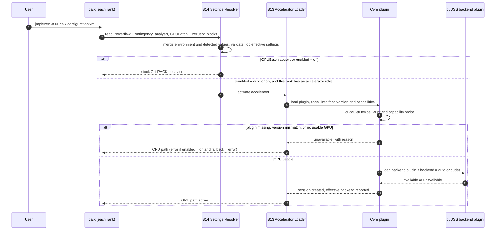
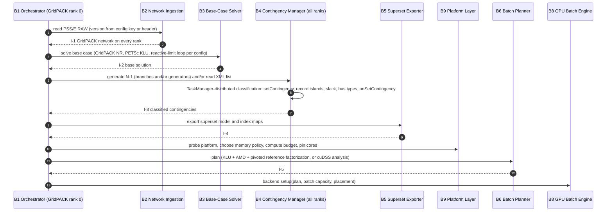
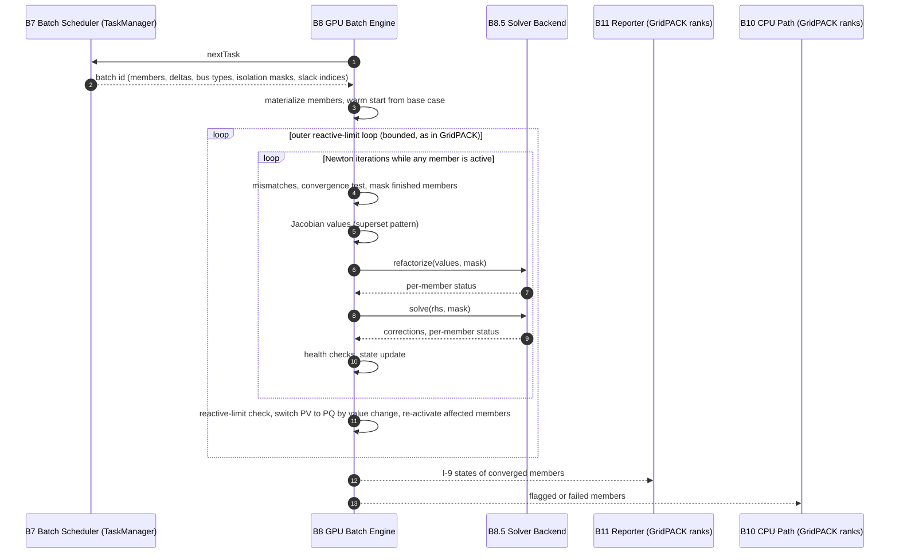
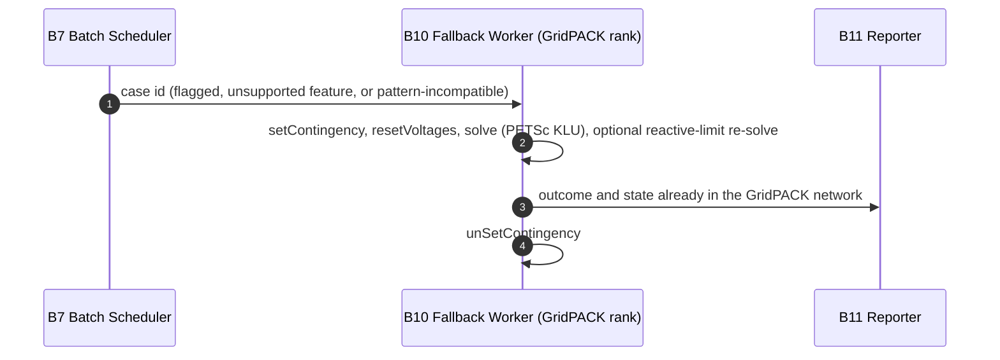
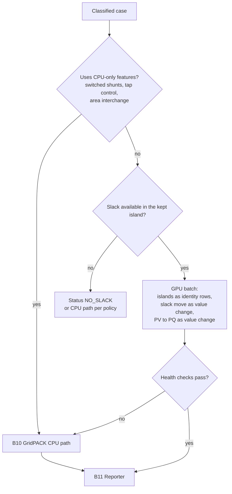
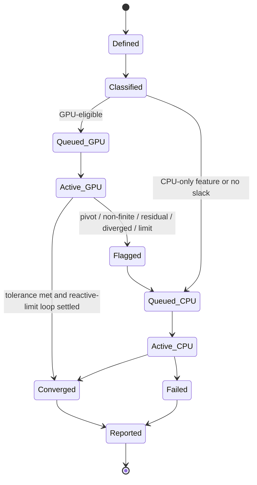
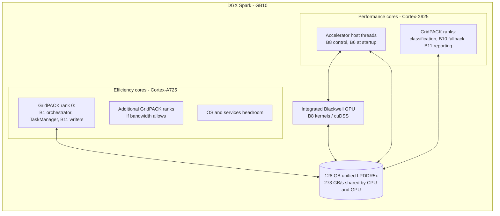

## 6. Runtime View

### 6.0 Scenario R0 — Start-up, Settings Resolution, and Accelerator Activation

The user starts the run exactly as with stock GridPACK, for example `mpiexec -n 12 ca.x configuration.xml`, or `ca.x configuration.xml` for a single rank. Inside the container, the same command is given as the container's command (Section 7.3.3).



**Rules:**
- With `GPUBatch/enabled = auto` (the default when the block is present), an unusable accelerator silently degrades to the GridPACK CPU path, with the reason logged. With `enabled = on`, `GPUBatch/onUnavailable` decides whether to fall back or stop (Appendix G). This follows the CUDA guide's advice to test for a usable device and take an alternative path when none is found [CUDA-BP §17.1].
- Every rank resolves the same settings. Ranks with an accelerator role are chosen at run time by `Execution/acceleratorRanks`, with a default of one per visible GPU (Section 8.16).
- The effective values, their sources, the plugin and backend versions, the detected GPU and compute capability, and the selected memory profile are written to the log before any computation starts (RT-3).

### 6.1 Scenario R1 — Study Initialization



**Notes:**
- Classification needs no power-flow solve. It reuses GridPACK's own contingency application logic, so slack-transfer and island semantics are identical to stock GridPACK [GPK-PF].
- GridPACK's contingency driver builds one network copy per rank and forces one contingency per rank, because an outaged branch may straddle a multi-rank partition [GPK-CA]. Classification and the CPU path inherit this replicated layout.

### 6.2 Scenario R2 — GPU Batch Execution



**Behavioral rules:**
1. **Convergence:** every mismatch below the tolerance, which defaults to GridPACK's 10⁻⁶ [GPK-PF][D §II.B].
2. **Iteration limit:** defaults to GridPACK's 50 [GPK-PF].
3. **Masking:** masked members are never refactorized or solved again [P].
4. **Reactive limits:** follow GridPACK's `qlim`, `qlimDeadband`, and `maxQlimIterations` semantics (Section 5.3.3).
5. **Backfilling:** MAY refill freed slots to keep occupancy high [P].

### 6.3 Scenario R3 — Fallback on the GridPACK CPU Path



GridPACK's stock driver resets voltages to the values loaded from the RAW file before each case [GPK-PF]. The batch path instead starts from the computed base-case solution (ADR-05). The fallback path MAY keep GridPACK's behavior unchanged; the difference is recorded in validation reports [P].

### 6.4 Scenario R4 — Routing of Structure-Changing Cases



### 6.5 Scenario R5 — Reporting and Reconciliation

1. B11 workers on GridPACK ranks pull converged cases. For each case, they apply the case with `setContingency`, inject the state, run GridPACK's checks and writers, then restore with `unSetContingency` [GPK-PF][GPK-CA] + [P].
2. B1 reconciles finished case indices against the contingency list. Missing cases are reported as `MISSING`, and the study is flagged incomplete.
3. Final files are sorted by event index [GPK-CA] + [P].

### 6.6 Case Lifecycle



---

## 7. Deployment View

### 7.1 Reference Deployment — Single DGX Spark

#### 7.1.1 Software stack

| Layer | Component | Basis |
|---|---|---|
| OS | DGX OS 8 (Ubuntu 26.04 base, NVIDIA-optimized Linux 7.0 kernel, R595 driver branch). DGX OS 7 (Ubuntu 24.04 base) MUST also work. | [DGXOS8][SPK-PG] |
| CUDA | CUDA 13.x (compute capability 12.1 requires 13.0+). | [KS][CUDA-RN] |
| GPU libraries | cuDSS release with DGX Spark support. | [NV-DSS] |
| GridPACK | Develop branch or a release with ARM64 images. | [GPK] |
| GridPACK dependencies | Boost 1.81, Global Arrays 5.9.1, PETSc 3.24.2 with SuiteSparse/SuperLU_DIST/MUMPS/ParMETIS, OpenMPI. | [GPK] |
| Containers | NVIDIA Container Toolkit is preinstalled on DGX Spark; DGX OS 8 uses Ubuntu's docker.io package. The GPU image is built from GridPACK's own Dockerfile with a CUDA base image selected by build argument (Section 7.3.3). NVIDIA publishes multi-architecture CUDA 13.4 development images for Ubuntu 24.04 and 26.04 [NV-IMG]. | [SPK-HW][DGXOS8][GPK][NV-IMG] |

#### 7.1.2 Process and core placement



| Placement rule | Rationale | Basis |
|---|---|---|
| Core types and clusters MUST be discovered at run time (for example from sysfs or hwloc), not hard-coded. | Published descriptions of the GB10 cluster layout differ in detail. | [SPK-PG][SR] |
| Accelerator host threads go on performance cores. | Kernel-launch latency and host-side control are on the critical path. | [P] |
| Rank 0 and output writing go on efficiency cores. | Mostly I/O and bookkeeping. | [P] |
| CPU-path ranks start on performance cores and expand to efficiency cores only if GPU throughput does not drop. | CPU and GPU share one memory system on DGX Spark, so heavy CPU work can reduce the bandwidth left for GPU batches. | [SPK-PG] + [P] |
| At least one core is left for the OS. | Responsiveness and stability. | [P] |

#### 7.1.3 Memory budget on unified memory

On DGX Spark, the OS, the page cache, every GridPACK rank's network replica, the superset model, the batch buffers, and the solver workspaces all draw from one 128 GB pool [SPK-PG].

| Rule | Basis |
|---|---|
| Free memory MUST NOT be judged from `cudaMemGetInfo` alone. NVIDIA documents that it under-reports allocatable memory on DGX Spark, because the OS can reclaim page cache and swap. | [SPK-PG] |
| Batch admission MUST keep a safety headroom. A public issue report describes a DGX Spark that stopped responding entirely under sustained unified-memory pressure, instead of failing the allocation cleanly. | [OGKM] + [P] |
| Per-rank GridPACK memory MUST be measured during the first study on a grid and fed into the budgeter (Section 8.7). | [P] |

#### 7.1.4 Clustering several DGX Sparks

GridPACK's TaskManager and MPI span nodes, so batches and fallback cases distribute across machines without design changes [GPK-PAR].
- **Supported cluster sizes:** NVIDIA's tools support connecting up to three DGX Sparks without a switch, and up to four with one [SPK-RN].
- **No GPUDirect RDMA:** messages are staged through host memory [SPK-PG]. Only small messages cross nodes in this design (case identifiers, statuses, result rows), so this is acceptable [P].

### 7.2 Platform Profiles (ARM + NVIDIA + Linux)

| Profile | Examples | Memory paradigm | Detection | Placement summary (Section 8.8) |
|---|---|---|---|---|
| **U — Integrated, unified memory** | GB10 systems (DGX Spark and OEM GB10 systems, sm_121) [SPK-HW][CT]; Jetson AGX Thor (sm_110) [CUDA-RN]; Jetson AGX Orin (sm_87; separate JetPack CUDA packaging) [NV-DSS][CUDA-RN] | One physical memory shared by CPU and GPU | Integrated-GPU attribute = 1 | GPU-only buffers as device allocations. Shared I/O buffers as pinned or registered host memory, or as pageable memory where pageable access is supported (Thor onward on Tegra) [TEGRA][SPK-PG]. |
| **C — Hardware-coherent, separate GPU memory** | Grace Hopper (sm_90), Grace Blackwell datacenter parts | CPU memory and GPU memory joined by NVLink-C2C; address translation services (ATS) give the GPU coherent access to system memory | Pageable-memory-access = 1 and host-page-table coherence = 1 [CUDA-UM] | GPU-only buffers in GPU memory. Shared buffers may be ordinary system allocations, but large regions SHOULD use large pages to avoid TLB misses [CUDA-UM]. |
| **D — Discrete PCIe GPU on an Arm server** | Arm server with an NVIDIA PCIe GPU | Separate memories. Software coherence through Linux HMM if the kernel, GPU (compute capability 7.5+), and driver (535+, open kernel modules) support it [CUDA-UM]. | Integrated = 0 and host-page-table coherence = 0 | GPU-only buffers in device memory; explicit asynchronous copies through pinned staging buffers at batch start and end. |

### 7.3 Build, Packaging, and Container

#### 7.3.1 Artifacts and installed layout

| Artifact | Installed location | Notes |
|---|---|---|
| `ca.x` | `<prefix>/bin/ca.x` | GridPACK already installs `ca.x` to `bin` [GPK-CA]. Its command line is unchanged (T-8). |
| Core GPU plugin | `<prefix>/lib/gridpack/plugins/` [P] | Found at run time: first `GPUBatch/pluginPath`, then an environment variable, then the path relative to the installed `ca.x` (Appendix G). |
| cuDSS backend plugin | Same directory [P] | Optional; built only when cuDSS headers are present at build time. |
| Example GPU configuration | `<prefix>/share/gridpack/example/contingency_analysis/` | Alongside GridPACK's existing contingency-analysis examples [GPK-CA]. |

#### 7.3.2 CMake build (summary)

The GPU code is a new subdirectory of GridPACK's CMake tree that enables CUDA only when a CUDA compiler is found. Because the plugins are loaded at run time rather than linked into `ca.x`, CUDA needs to be enabled only in that subdirectory: CMake requires `enable_language` in the highest directory common to all targets that use the language directly or through link dependencies [CMAKE]. A system without a CUDA toolkit therefore builds exactly today's GridPACK. Section 8.19 gives the target structure and how it meets *Effective Modern CMake*.

| Decision | Rule | Basis |
|---|---|---|
| GPU code targets | Default `CUDA_ARCHITECTURES` value `all`: native code for all supported real architectures plus PTX for the highest major architecture. The driver picks the best embedded binary at run time, or compiles PTX just in time for newer devices. A different list may be supplied at configure time, including through the `CUDAARCHS` environment variable. `native` is not used for images, because it targets only the build machine's GPU. | [CMAKE][CUDA-BP §17.3] |
| CUDA runtime | Linked statically into the plugins. | [CUDA-BP §17.4, §16.4.1.5] |
| CPU targets | No `-march=native`-style flags in images. Architecture flags, where needed, are set per platform profile. Armv8.2-A is the safe floor for CUDA 14 on Arm servers. | [CUDA-RN] + [P] |
| Jetson Orin | Separate build profile using JetPack's CUDA, since CUDA 13's unified Arm toolkit does not cover Orin. | [CUDA-RN] |

#### 7.3.3 Container build and run

The image is built from **GridPACK's existing Dockerfile**, extended only with build arguments and added steps (ADR-20). With default arguments, it builds today's image. The additions, each conforming to the Dockerfile reference [DF]:

| Addition | Purpose | Basis in [DF] |
|---|---|---|
| A pinned `syntax` parser directive and `check=error=true` at the top of the file | Run Docker's build checks and fail on warnings. The reference recommends pinning the syntax version when `error=true` is set, so new checks cannot break builds unexpectedly. | `syntax`, `check` directives |
| `ARG BASE_IMAGE=ubuntu:questing` before `FROM ${BASE_IMAGE}` | Select a CUDA development base image for GPU builds, while keeping the existing default. `ARG` is the only instruction allowed before `FROM`. | FROM; "Understand how ARG and FROM interact" |
| `ARG GRIDPACK_ENABLE_GPU_BATCH=OFF`, `ARG CUDA_ARCHITECTURES=all`, `ARG CUDSS_APT_PACKAGE=cudss`, `ARG GRIDPACK_BUILD_TYPE=Debug` | Build-time choices only (Section 2.6). The defaults reproduce the existing image, including its existing Debug build type. GPU images SHOULD pass a Release type [P]. | ARG |
| A cuDSS installation step that runs only when the GPU build is enabled, using `apt-get` with `--no-install-recommends` and cache mounts with `sharing=locked` | Install cuDSS from NVIDIA's package repository, whose package installs a CMake package exporting the `cudss` target [NV-DSS]. Any remote file fetched directly MUST be verified, for example with `ADD --checksum`. | RUN `--mount=type=cache` example for apt; ADD `--checksum` |
| Two extra `-D` options appended to the existing CMake invocation | Pass the GPU switch and architecture list. | — |
| `ENV PATH=<install>/bin:${PATH}` | Put `ca.x` on the path, so the user command is simply `ca.x configuration.xml`. | ENV |
| `WORKDIR <root>/workspace` | Start in the workspace directory used by GridPACK's documented `docker run` example. The reference recommends setting `WORKDIR` explicitly. | WORKDIR |
| `CMD ["/bin/bash"]` in exec form | Make the image's default command explicit without changing behavior. The reference says a Dockerfile should specify at least one of `CMD` or `ENTRYPOINT`, and prefers exec form. No `ENTRYPOINT` is added, so GridPACK's documented usage (`docker run … bash`) keeps working. | CMD; ENTRYPOINT; "Understand how CMD and ENTRYPOINT interact" |
| OCI `LABEL`s for version and source | Image metadata. | LABEL |

**Existing lines that conflict with the reference are left unchanged** under exception rule S-3 and recorded in Appendix F. One example: the existing `ENV DEBIAN_FRONTEND=noninteractive` persists into the image, which the reference warns can confuse users and suggests replacing with `ARG` or a per-command setting [DF].

**Building and running (illustrative):**

```bash
# Stock GridPACK image: unchanged
docker build -t gridpack .

# GPU-enabled image from the same Dockerfile
docker build \
  --build-arg BASE_IMAGE=nvidia/cuda:13.4.2-devel-ubuntu26.04 \
  --build-arg GRIDPACK_ENABLE_GPU_BATCH=ON \
  --build-arg GRIDPACK_BUILD_TYPE=Release \
  -t gridpack:gpu .

# Run: the container command is the usual GridPACK command line
docker run --rm --gpus all -v "$PWD":/app/workspace gridpack:gpu \
  mpiexec -n 12 ca.x configuration.xml
```

| Run-time topic | Rule | Basis |
|---|---|---|
| GPU access | The NVIDIA Container Toolkit is required to run CUDA images. On DGX Spark with DGX OS, GPUs MAY instead be requested as CDI devices (`--device nvidia.com/gpu=all`). | [NV-IMG][DF] + [ULT] |
| No GPU passed to the container | `ca.x` runs on the GridPACK CPU path (RT-4, T-9). | [CUDA-BP §17.1] |
| Device selection | `CUDA_VISIBLE_DEVICES` (environment). | [CUDA-BP §18.5] |
| JIT cache | When PTX is compiled just in time, the driver caches the result on disk; its location and size are controlled by environment variables. Containers SHOULD point the cache at a persistent volume, so JIT cost is paid once. | [CUDA-BP §18.4] + [P] |
| Image tags | CUDA image tags have limited lifetimes, and the `latest` tag is deprecated. Builds pin a full version tag, optionally with a digest, which `FROM` supports. | [NV-IMG][DF] |
| Shared memory for MPI | MPI ranks in one container communicate through shared memory; the container's shared-memory size SHOULD be raised, or the host IPC namespace used, if ranks fail to start. To be validated. | [P] |

#### 7.3.4 Build profiles

| Profile | Base image (build argument) | GPU plugins | Notes |
|---|---|---|---|
| Stock / CPU-only | `ubuntu:questing` (existing default) | Not built | Identical to today's GridPACK image. |
| DGX Spark and Arm servers (SBSA) | CUDA 13.x development image for Ubuntu 26.04 or 24.04 [NV-IMG] | Core + cuDSS | One multi-architecture build also serves x86_64 hosts. |
| Jetson Thor | JetPack-based image [P] | Core + cuDSS | cuDSS supports Thor [NV-DSS]. |
| Jetson Orin | JetPack-based image [P] | Core + cuDSS | Separate CUDA packaging [CUDA-RN]. |

### 7.4 Reference Hardware from the Source Studies

These platforms calibrate expectations only; none of them is the target.

| Study | CPU | GPU | Software |
|---|---|---|---|
| [D] platform 1 | Intel Xeon Gold 6132 | NVIDIA V100, 32 GB HBM2 | GCC 8.3.0, CUDA 10.1.243 |
| [D] platform 2 | Intel Xeon Broadwell, 128 GB | NVIDIA Tesla P100, 16 GB HBM2 | — |
| [Z] | 2 × Intel Xeon E5-2620 | NVIDIA Tesla K40 | CUDA 7.5 |
| Target | 10 × Cortex-X925 + 10 × Cortex-A725 | GB10 integrated Blackwell GPU, 128 GB unified memory, 273 GB/s | DGX OS 8, CUDA 13.x |
