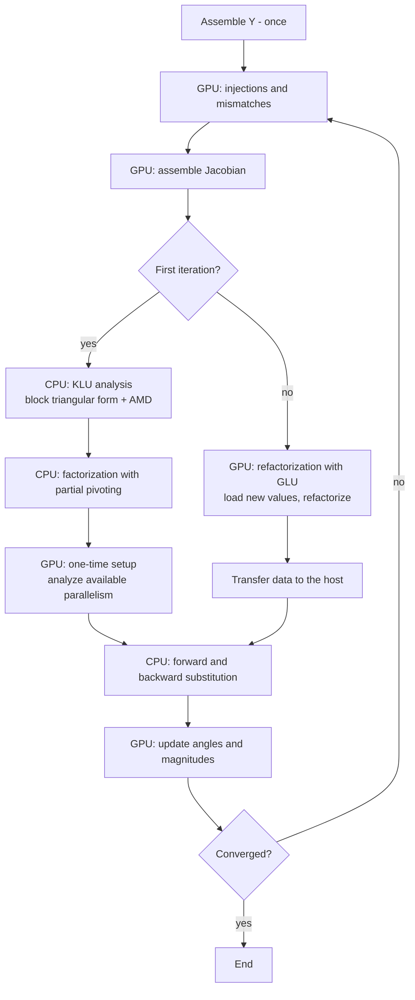

## 9. Architecture Decisions

All records are **Proposed** until prototyping confirms them. ADR-01 to ADR-09 revise version 0.1; ADR-10 to ADR-15 were added in 0.2; ADR-16 to ADR-22 are new in 0.3.

### ADR-01: Full Newton-Raphson, polar form

| | |
|---|---|
| **Context** | Kundur recommends Newton-Raphson for large systems that need accurate solutions, and notes that fast decoupled methods may fail with very large angles or special controls [K §6.4.5]. Both reference papers and GridPACK use Newton-Raphson [D][Z][GPK-PF]. |
| **Decision** | Full Newton-Raphson in polar form on both paths, with GridPACK's equations. |
| **Consequences** | A Jacobian is assembled and refactorized every iteration, which is exactly the work the batch accelerates. |

### ADR-02: One-time KLU + AMD planning on the CPU

| | |
|---|---|
| **Context** | KLU + AMD gave the least fill-in and the fastest analysis in [D], and the KLU-based hybrid was the fastest variant there. KLU ships with GridPACK's PETSc build [GPK][PETSC]. |
| **Decision** | B6 runs KLU + AMD analysis and a pivoted reference factorization once, on the superset pattern, calling SuiteSparse KLU directly. When cuDSS is the backend, cuDSS's own analysis MAY replace it, optionally seeded with the KLU permutation. |
| **Consequences** | No new CPU solver dependency. Planning cost is paid once per study. |

### ADR-03: Placeholder zeros for outaged elements

| | |
|---|---|
| **Context** | Batch refactorization needs identical structure across members [Z][NV-RF][NV-DSS]. |
| **Decision** | Outages zero out values; they never remove entries. Deltas come from GridPACK's per-circuit Y contributions [GPK-YM]. This is now part of the superset pattern (ADR-08). |
| **Consequences** | A few redundant zeros per case; one plan for all cases. |

### ADR-04: Batched solve on the GPU (configurable)

| | |
|---|---|
| **Context** | D'Orto kept the solve on the CPU, because a single-system GPU solve was slower [D, Table 5]. In batch form, a host-side solve per member and per iteration would need the factors on the host. On unified memory this needs coherent allocation rather than copies, but it serializes members onto at most about 20 CPU cores [SPK-HW] + [P]. Zhou states that batching applies to substitution [Z §III]; Wang optimized batched substitution [W21]. |
| **Decision** | Batched GPU solve by default. A host-solve option is kept for experiments and is benchmarked (PERF-2). |
| **Consequences** | Solve-kernel efficiency is performance-critical. |

### ADR-05: Warm start from the base-case solution

| | |
|---|---|
| **Context** | Newton-Raphson is not suited to flat starts; a previously solved similar case is preferred [K §6.4.5, §6.4.7 footnote]. GridPACK's driver resets each case to the voltages read from the RAW file [GPK-PF]. |
| **Decision** | GPU batches start from the computed base-case solution. The GridPACK CPU path keeps its own behavior unless configured otherwise. |
| **Consequences** | Fewer iterations are expected (measured by B12). Validation records the warm-start difference (Section 8.10). |

### ADR-06: Batch solver backend abstraction; cuDSS as initial default

| | |
|---|---|
| **Context** | cuDSS supports uniform batches on SBSA, Jetson Orin and Thor, and DGX Spark, with CUDA 13 [NV-DSS]. A defect has been reported above about 160 members in version 0.8.0 [NV-F]. cuSolverRF is fully deprecated in CUDA 13 [CUDA-RN]. |
| **Decision** | Use the I-8 contract with three implementations: cuDSS (initial default, capped at its validated batch size), custom Algorithm 2, and a CPU reference. No production use of cuSolverRF. |
| **Consequences** | Libraries can be swapped as they evolve; a GPU-less build stays possible. |

### ADR-07: The CPU path is GridPACK

| | |
|---|---|
| **Context** | v0.1 proposed a custom KLU fallback. GridPACK already contains a complete per-case CPU contingency loop, with slack transfer, island handling, reactive-limit re-solve, and checks [GPK-CA][GPK-PF]. |
| **Decision** | Flagged and CPU-only cases run through GridPACK's per-case loop on GridPACK ranks, or through the stock application on a generated list. |
| **Consequences** | No duplicate fallback logic. Fallback results are GridPACK's by definition. |

### ADR-08: Superset (LARGE_MATRIX-derived) pattern keeps structure-changing cases on the GPU

| | |
|---|---|
| **Context** | In GridPACK's default formulation, the Jacobian's structure depends on bus types, slack placement, outages, and isolation. GridPACK's optional `LARGE_MATRIX` formulation removes the bus-type dependence by using fixed-voltage rows for PV buses and identity rows for the reference bus [GPK-PF]. |
| **Decision** | The batch path uses a superset pattern (Section 8.3.3) that also keeps blocks for outaged branches, slack-adjacent branches, and isolatable buses. Isolation, slack moves, PV→PQ changes, and reactive-limit switching become value changes. This supersedes v0.1's ADR-08 options. |
| **Alternatives** | v0.1 approach (route these cases to the CPU); sub-batches grouped by bus-type signature, each with its own plan. |
| **Consequences** | Broad GPU coverage and a single plan, at the cost of a larger Jacobian (measured per grid) and new row-switch numerics (Risk R-1). |

### ADR-09: Dynamic work distribution with GridPACK's TaskManager

| | |
|---|---|
| **Context** | Case difficulty varies. GridPACK's TaskManager hands out task identifiers dynamically through a Global Arrays counter, and its contingency driver already uses it [GPK-PAR][GPK-CA]. |
| **Decision** | Task identifiers name batches (GPU workers) or single cases (CPU path and reporter). |
| **Consequences** | Load balance across ranks and nodes; results sorted at write time. |

### ADR-10: GridPACK as the host framework

| | |
|---|---|
| **Context** | The user requirement is to maximize reuse. GridPACK provides PSS/E RAW parsing (v23–v36), the network model, power flow, N-1 generation, contingency semantics, task distribution, configuration, results exporters, a BSD-style license, a build stack, and multi-architecture Docker images [GPK]. |
| **Decision** | GridPACK hosts the application. New code is confined to B6, B8, B9, and small extensions (B1, B5, B11.1). |
| **Alternatives** | A standalone solver (v0.1); building on ExaGO (optimization-oriented; its power-flow application is less developed); a pandapower-based stack (Python; batched GPU power flow has been demonstrated with it [W21]). |
| **Consequences** | GridPACK's MPI and Global Arrays model is inherited, including its one-network-copy-per-rank layout. Version pinning is needed, since the develop branch evolves (Risk R-12). |

### ADR-11: PSS/E RAW through GridPACK's parsers

| | |
|---|---|
| **Context** | RAW is the primary input. GridPACK reads v23, v33, v34, v35, and v36, auto-detects the version from the header, and reads v30–v32 as v33 [GPK-PF]. |
| **Decision** | No new parser. The accelerator consumes GridPACK's in-memory network, never RAW text. |
| **Consequences** | RAW-version handling, including three-winding transformers represented with star buses [GPK-PF], is inherited. RAW features GridPACK ignores are also ignored here. |

### ADR-12: Reporting through GridPACK (state injection)

| | |
|---|---|
| **Context** | GridPACK's checks and exporters define the expected outputs [GPK-CA]. |
| **Decision** | GPU states are injected into GridPACK replicas; GridPACK computes flows and violations and writes all files. A GPU-side flow calculation MAY be added later if reporting becomes the bottleneck, validated against GridPACK. |
| **Consequences** | Output parity by construction; CPU reporting work scales with the number of cases (measured). |

### ADR-13: Run-time platform probing and memory-placement policy

| | |
|---|---|
| **Context** | Target systems differ in memory paradigm: integrated unified memory, hardware-coherent C2C, or discrete PCIe [CUDA-UM][TEGRA][SPK-PG]. |
| **Decision** | B9 probes capabilities and applies Section 8.8's placement table. No compile-time assumption about the memory paradigm. |
| **Consequences** | One binary family for all profiles; the placement table is tested on each profile. |

### ADR-14: Multi-architecture builds

| | |
|---|---|
| **Context** | Blackwell variants are distinct targets; libraries may lack sm_121 code [KS]. Jetson Orin is outside CUDA 13's unified Arm toolkit [CUDA-RN]. |
| **Decision** | Native code for all supported compute capabilities plus PTX; a separate Jetson Orin build profile; containers per platform family. |
| **Consequences** | Longer builds; broad compatibility. |

### ADR-15: PETSc stays CPU-only

| | |
|---|---|
| **Context** | GridPACK creates sparse matrices with PETSc's AIJ types and then applies PETSc options, so GPU matrix types could be selected [GPK-MATH]. However, PETSc's GPU-capable factorization types [PETSC] appear to factor one system at a time [P], and single-system GPU sparse factorization did not beat the CPU in [D]. |
| **Decision** | PETSc is built and used CPU-only. GPU work is confined to the batch engine. |
| **Consequences** | Simpler builds; no conflicts between PETSc and the accelerator over the GPU. |

### ADR-16: Accelerator as runtime-loaded plugins

| | |
|---|---|
| **Context** | The same `ca.x` must run with or without a GPU, driver, CUDA libraries, or cuDSS (T-9, RT-1). The CUDA guide advises testing for CUDA availability and falling back when it is absent [CUDA-BP §17.1], linking the CUDA runtime statically, and shipping dynamic-only libraries with the application [CUDA-BP §17.4]. |
| **Decision** | GPU code is built as a core plugin and a separate cuDSS backend plugin, loaded at run time by `ca.x` through a versioned C-style interface (I-10, I-11). `ca.x` links no CUDA library. |
| **Alternatives** | Link the accelerator into `ca.x` (fails to start where CUDA libraries are missing); a separate GPU executable (violates FR-12). |
| **Consequences** | One `ca.x` for all systems. Backends can be added without rebuilding `ca.x`. The plugin interface becomes a versioned contract (Section 5.3.6). |

### ADR-17: Unchanged entry point and XML-only configuration

| | |
|---|---|
| **Context** | Users run `ca.x` with an XML file, and the XML names the RAW case [GPK-CA][GPK-PF]. |
| **Decision** | No new executables, wrapper scripts, or required arguments. All new behavior is controlled by optional XML blocks (`GPUBatch`, `Execution`), environment variables for deployment-level settings, and detection. A configuration without the new blocks runs stock GridPACK. |
| **Consequences** | Existing scripts and configurations keep working. All accelerator choices are discoverable in one file and in the start-up log. |

### ADR-18: C++17 baseline with the Guidelines Support Library

| | |
|---|---|
| **Context** | GridPACK sets no C++ standard and builds with the compiler default [GPK]. The guidelines rely on support-library types (`span`, `not_null`, `Expects`) [CG P.13][CG GSL.view][CG GSL.assert]. Some rules assume C++20 features, notably concepts [CG T.10]. |
| **Decision** | New C++ and CUDA code targets C++17 and uses a Guidelines Support Library implementation. Template requirements are documented and checked with static assertions; the absence of language concepts is a recorded exception, to be lifted when the toolchain moves to C++20. |
| **Alternatives** | C++20 for new code only (risks mixed-standard builds with GridPACK headers and mixed host/device support). |
| **Consequences** | Compatible with GridPACK and CUDA toolchains; one recorded exception (Appendix F). |

### ADR-19: Error-handling strategy

| | |
|---|---|
| **Context** | The guidelines ask for an early, explicit strategy [CG E.1]; device code and C-style boundaries cannot use exceptions [CG E.25–E.27][CG I.26]; CUDA calls must all be checked [CUDA-BP §17.2]. |
| **Decision** | Host failures to perform a task throw purpose-designed exception types [CG E.2][CG E.14]. Expected outcomes (non-convergence, flagged members) are status values [CG E.3]. Plugin boundaries and device code return status codes systematically [CG E.27]. Every CUDA call and kernel launch is checked [CUDA-BP §17.2]. Adapters convert between the two styles at each boundary [CG I.30]. |
| **Consequences** | No exception crosses a plugin boundary or appears in device code; failures are never silent. |

### ADR-20: Container built from GridPACK's Dockerfile through build arguments

| | |
|---|---|
| **Context** | The pipeline must build into a container as GridPACK does (FR-13). GridPACK's documented usage runs `bash` in the image [GPK]. The Dockerfile reference prefers exec-form commands and asks for at least one of `CMD` or `ENTRYPOINT` [DF]. |
| **Decision** | Extend the existing Dockerfile with build arguments (base image, GPU switch, architectures, cuDSS package, build type) and conforming added steps; default arguments reproduce today's image. Add an explicit exec-form `CMD ["/bin/bash"]` and no `ENTRYPOINT`, so `docker run … ca.x configuration.xml` and `docker run … bash` both work. Leave existing conflicting lines unchanged (exception S-3). |
| **Alternatives** | A separate GPU Dockerfile (duplicates the GridPACK recipe); an `ENTRYPOINT` of `ca.x` (breaks the documented `bash` usage). |
| **Consequences** | One recipe; reproducible pinned images; existing users unaffected. |

### ADR-21: CMake integration as an optional subdirectory with targets

| | |
|---|---|
| **Context** | GridPACK's CMake is partly directory-scoped and variable-based [GPK]. New CMake must follow [EMC]. CUDA must be optional at build time, and CMake requires a language to be enabled in the highest directory common to its users [CMAKE]. |
| **Decision** | A new subdirectory defines namespaced targets with explicit scopes and imported dependency targets, enables CUDA only when `check_language(CUDA)` finds a compiler, and adds plugins that `ca.x` does not link. One existing line, the `ca.x` link call, gains an explicit `PRIVATE` keyword (Section 8.19). |
| **Consequences** | Builds without a CUDA toolkit are unchanged; GPU builds need CMake 3.23 or later (T-11). |

### ADR-22: GridPACK's `LARGE_MATRIX` formulation becomes a run-time choice (extension E6)

| | |
|---|---|
| **Context** | `LARGE_MATRIX` is a commented-out preprocessor switch in GridPACK's power-flow components [GPK-PF]. RT-1 asks for run-time selection where possible; the guidelines discourage macros for program logic [CG ES.30][CG ES.31]. |
| **Decision** | Propose an optional extension that replaces the switch with a per-component formulation setting applied by the factory, defaulting to the standard formulation. It is used only as a test oracle for the superset kernels. |
| **Consequences** | Oracle tests need no special GridPACK build. Upstream acceptance is required; until then the oracle uses a separately compiled test build (recorded as a build-time residual). |

---

## 10. Quality Requirements

### 10.1 Quality Requirements Overview

- **Performance:** cases per second on a DGX Spark; speedup over stock GridPACK on the same machine; scaling across clustered Sparks.
- **Fidelity:** parity with GridPACK.
- **Completeness:** one outcome per case.
- **Portability:** Profiles U, C, and D; GPU-less build; DGX OS 7 and 8.
- **Reuse:** minimal, optional GridPACK changes.
- **Evolvability:** replaceable backend.
- **Configurability:** behavior changes without rebuilding.
- **Code quality:** conformance to the four standards; recorded exceptions only.

### 10.2 Quality Scenarios

Targets marked TBD are fixed during prototyping; [P] values are proposals.

| ID | Quality | Stimulus | Expected response | Measure |
|---|---|---|---|---|
| PERF-1 | Throughput | Full N-1 study of a large PSS/E RAW case on one DGX Spark | All cases solved | Cases per second; speedup vs. stock GridPACK contingency analysis on the same Spark, TBD |
| PERF-2 | Solve placement | GPU-batched vs. host solve | Faster option becomes the default | Whole-study time |
| PERF-3 | Saturation | Batch size sweep | Throughput plateau found | Batch size at 95% of peak [P]; achieved bandwidth vs. 273 GB/s |
| PERF-4 | Bandwidth sharing | Vary active CPU-path ranks during GPU batches | Optimal rank count identified | GPU throughput vs. CPU ranks |
| PERF-5 | Scalability | Two or more DGX Sparks over ConnectX-7 | Near-linear scaling | Parallel efficiency, TBD |
| FID-1 | Fidelity | Every GPU case re-run by stock GridPACK | Equivalent results | Voltage/angle tolerance (Section 8.14); identical status |
| FID-2 | Output parity | Compare GridPACK output files | Equal after sorting | Within numeric tolerance |
| CMP-1 | Completeness | Study with diverged, islanded, and flagged cases | One outcome per case | 0 missing |
| ROB-1 | Robustness | Zero pivot in one batch member | Member re-solved by GridPACK; batch continues | No batch-wide failure |
| ROB-2 | Robustness | Memory near the budget on unified memory | Admission control shrinks batches | No host stall; no OOM |
| PORT-1 | Portability | Build and run on a second Arm + NVIDIA system of another profile | Same results within tolerance | No source changes; build profile only |
| PORT-2 | Portability | Build without CUDA | GridPACK-only path runs | Passes the FID suite |
| PORT-3 | Portability | DGX OS 7 (Ubuntu 24.04) and DGX OS 8 (Ubuntu 26.04) | Both run | Same results |
| REUSE-1 | Reuse | Apply the GridPACK extensions | Stock GridPACK tests still pass; extensions off by default | Patch size and test results |
| EVO-1 | Evolvability | Add a backend | Only a new backend plugin and configuration change | No changes to `ca.x` or the core plugin |
| CONF-1 | Configurability | Switch backend, batch size, memory profile, solve placement, and telemetry between runs | Each takes effect from `configuration.xml` alone | No rebuild; effective values appear in the start-up log |
| CONF-2 | Configurability | Run with no `GPUBatch` block | Stock GridPACK behavior | Outputs identical to stock `ca.x` |
| CONF-3 | Configurability | Run the GPU image on a machine with no GPU, or start the container without GPU access | CPU path with a logged reason | Run completes; no crash |
| CONF-4 | Configurability | Invalid value in `GPUBatch` | Stop at start-up with a clear message | No partial run |
| STD-1 | Code quality | Static analysis of new C++ with `cppcoreguidelines-*` checks and a second analyzer | No unrecorded findings | Every suppression cites an Appendix F entry |
| STD-2 | Code quality | Review of new CUDA against [CUDA-BP] | All relevant High-priority recommendations applied; deliberate omissions recorded | Checklist complete; every CUDA call and launch checked |
| STD-3 | Code quality | Docker build with build checks set to fail on warnings | Build passes | No new warnings |
| STD-4 | Code quality | CMake review against [EMC]; warning-count comparison in CI | No new directory-scoped commands, globs, or flag edits; no increase in warnings | Review checklist complete |
| DOCK-1 | Container | Build with default arguments | Today's GridPACK image | Same packages and behavior; `docker run … bash` works |
| DOCK-2 | Container | Build the GPU image for arm64 and amd64 | Both images run `ca.x configuration.xml` | Passes the FID suite on DGX Spark |

---

## 11. Risks and Technical Debt

### 11.1 Risks

| ID | Risk | Mitigation |
|---|---|---|
| R-1 | The fixed pivot order is poor for some cases, especially after superset row switches. | Health checks; GridPACK fallback; optional iterative refinement [NV-DSS]. |
| R-2 | cuDSS uniform-batch defect above about 160 members (v0.8.0) [NV-F]. | Validation gates per batch size; NaN checks; version pinning; cross-check with the custom backend. |
| R-3 | cuSolverRF fully deprecated in CUDA 13 [CUDA-RN]. | Not used (ADR-06). |
| R-4 | Studies enabling switched shunts, tap control, or area interchange route everything to the CPU. | Document the limitation; measure; GPU support for controls as future work. |
| R-5 | Unified-memory pressure: GridPACK replicas × ranks plus batches exceed the pool. | Budgeter; measured replica size; fewer CPU ranks; smaller batches. |
| R-6 | Uneven convergence within a batch. | Masking; backfilling; occupancy telemetry. |
| R-7 | Evidence gap: the sources timed parts of the problem, on other hardware. | Benchmark plan (Chapter 10). |
| R-8 | Hardware generations differ from the sources (K40, P100, V100). | Re-measure on target. |
| R-9 | Internal inconsistencies in [D] (Appendix A.7). | Follow its abstract and figures. |
| R-10 | Superset overhead (2n rows, placeholders, fill) larger than expected. | Measure (Section 8.14); fall back to sub-batches grouped by bus-type signature if needed. |
| R-11 | GridPACK's `LARGE_MATRIX` path is off by default and may be little exercised. | Treat it as a reference, not as production code; parity tests against the default formulation's converged results. |
| R-12 | GridPACK develop-branch drift. Example: the contingency driver's `qlim` code default (true) differs from its README table (false) [GPK-CA][GP]. | Pin a GridPACK commit; set all keys explicitly; re-verify defaults on upgrade. |
| R-13 | DGX Spark platform behavior: a reported host stall under unified-memory pressure [OGKM]; reported power and thermal limits under sustained load, partly addressed by firmware [GS]. | Memory headroom; long-run soak tests; throughput telemetry over time. |
| R-14 | GB10 FP64 throughput not documented by NVIDIA. | Measure early. The workload is expected to be bandwidth-bound [Z] + [P]. |
| R-15 | Toolchain drift on Ubuntu 26.04 for Boost 1.81, Global Arrays 5.9.1, and PETSc builds. GridPACK's Dockerfile already adds warning flags for newer compilers [GPK]. | Containerized, pinned toolchain; CI on DGX OS 7 and 8. |
| R-16 | CPU–GPU bandwidth contention on unified memory. | PERF-4; tune rank counts. |
| R-17 | Library support lag for sm_121 [KS]. | Build own kernels for all targets; verify cuDSS version support [NV-DSS]. |
| R-18 | Jetson Orin packaging diverges from CUDA 13 Arm [CUDA-RN]. | Separate build profile; optional support tier. |
| R-19 | GridPACK interfaces force guideline deviations in the adapter layer (shared pointers, downcasts, static flags). | Confine to the adapter ([CG I.30]); record in Appendix F; propose upstream modernizations. |
| R-20 | Plugin interface drift between `ca.x` and plugins built at different times. | Versioned, size-prefixed records; load-time version checks; semantic versioning [CUDA-BP §16.4.1.4]. |
| R-21 | Static CUDA runtime plus dynamic cuDSS in one process: version skew between the runtime used by the plugin and what cuDSS expects. | Pin cuDSS to the toolkit major version in the image; check versions at load time; follow cuDSS release notes on compatibility [CUDA-BP §16.4.1.5][NV-DSS]. |
| R-22 | Container GPU access differs across platforms (`--gpus`, CDI devices, Jetson runtimes). | Document per profile (Section 7.3.4); the CPU fallback guarantees completion (CONF-3). |
| R-23 | JIT compilation of PTX on first run in a new container adds start-up time. | Native code for all supported architectures; persistent JIT cache volume [CUDA-BP §18.4]. |
| R-24 | Analyzer noise from GridPACK headers. | Restrict analysis to new sources; treat GridPACK headers as system headers in analysis [P]. |
| R-25 | GPU builds need CMake ≥ 3.23 while GridPACK declares 3.22 (T-11). | Version check only when the GPU build is requested; images ship a recent CMake. |
| R-26 | Upstream GridPACK may not accept extensions E1–E7. | Keep them small, optional, and default-off; carry them as a patch set until accepted. |

### 11.2 Technical Debt (planned deferrals)

| Deferred item | Notes |
|---|---|
| GPU support for switched shunts, tap control, area interchange | — |
| GPU-side flow and violation calculation | ADR-12 |
| Multiple energized islands with their own slacks | Section 8.6.2 |
| Distributed slack | Constraint C-7 |
| PSS/E `.con` adapter | Optional (B4.2) |
| N-k | Section 11.3 |
| Language concepts (C++20) | ADR-18; lifts the T.10 exception |
| Existing non-conforming Dockerfile and CMake lines | Recorded under S-3/S-4; candidates for separate, behavior-preserving clean-ups |

### 11.3 Extension Path to N-k

- **Placeholder zeros and the superset pattern** extend to multiple outages; Zhou et al. give the 2x rule for x outaged elements [Z §III].
- **GridPACK** already accepts multi-element contingencies in its XML lists [GPK-CA].
- **Screening** (B4.5) becomes mandatory as case counts grow combinatorially [Z16][GPS].

---

## 12. Glossary

| Term | Definition |
|---|---|
| **APOD** | Assess, Parallelize, Optimize, Deploy: the CUDA guide's iterative development cycle [CUDA-BP §2.2]. |
| **ATS** | Address Translation Services: hardware coherence between CPU and GPU page tables over NVLink-C2C, as on Grace Hopper and Grace Blackwell [CUDA-UM]. |
| **CDI** | Container Device Interface: a way to request devices such as GPUs for containers by name, for example `nvidia.com/gpu=all` [DF]. |
| **cuDSS** | NVIDIA's GPU direct sparse solver library, with uniform-batch support [NV-DSS]. |
| **DGX OS** | NVIDIA's Ubuntu-based OS for DGX systems; version 8 is based on Ubuntu 26.04 [DGXOS8]. |
| **DGX Spark** | Desktop system with the GB10 Grace Blackwell Superchip and 128 GB unified memory [SPK-HW]. |
| **Effective bandwidth** | Bytes read plus bytes written by a kernel, divided by its run time [CUDA-BP §9.2.2]. |
| **Exception register** | Appendix F's record of every standards deviation and its justification. |
| **GA (Global Arrays)** | Distributed shared-memory library used by GridPACK, including for its task counter [GPK][GPK-PAR]. |
| **GridPACK** | Open-source HPC power-grid simulation framework from PNNL: parsers, network, power flow, contingency analysis, and more [GPK]. |
| **GSL** | Guidelines Support Library: small types and functions the Core Guidelines rely on, such as `span`, `not_null`, and `Expects` [CG]. |
| **HMM** | Heterogeneous Memory Management: Linux software coherence that lets GPUs use system allocations on PCIe systems [CUDA-UM]. |
| **IREG PV bus** | GridPACK term for a remotely regulating PV bus, which keeps two equations [GPK-PF]. |
| **JIT compilation** | The driver's compilation of embedded PTX into native code for the present GPU at load time; results are cached on disk [CUDA-BP §18.4]. |
| **LARGE_MATRIX** | GridPACK compile-time option giving every bus a 2×2 Jacobian block, with fixed-voltage rows for PV buses and identity rows for the reference bus [GPK-PF]. |
| **PETSc** | Scientific computing toolkit used by GridPACK for linear algebra; exposes KLU via SuiteSparse [PETSC]. |
| **Plugin** | A shared object loaded by `ca.x` at run time through a versioned C-style interface (I-10, I-11). |
| **Profile U / C / D** | Platform profiles: integrated unified memory; hardware-coherent C2C; discrete PCIe (Section 7.2). |
| **PSS/E RAW** | Siemens PTI power-flow case format; GridPACK reads v23, v33, v34, v35, and v36 [GPK-PF]. |
| **PTX** | NVIDIA's virtual instruction set; embedding it gives forward compatibility with future GPUs [CUDA-BP §16.3.1]. |
| **RAII** | Resource acquisition is initialization: resources owned by objects whose destructors release them [CG R.1]. |
| **Runtime-first** | The principle that any behavior selectable at run time is a setting, not a build switch (Section 2.6). |
| **SBSA** | Arm Server Base System Architecture; the CUDA platform name for Arm servers [CUDA-RN]. |
| **Settings resolver** | B14: merges XML, environment, and detected values into logged effective settings. |
| **Superset pattern** | The single Jacobian structure containing every position any N-1 case can use (Section 8.3.3). |
| **TaskManager** | GridPACK's dynamic task-distribution utility [GPK-PAR]. |
| **UMA** | Unified memory architecture: CPU and GPU share physical memory [SPK-PG]. |

Terms from v0.1 retain their meanings:
- **AMD:** approximate minimum degree ordering.
- **Batch:** cases solved together on one GPU.
- **Block triangular form:** a permutation into square diagonal blocks.
- **Case-interleaved layout:** all members' values for one structural position stored side by side.
- **Fill-in:** zeros that become nonzero during elimination.
- **Flat start:** default starting voltages when no prior solution exists.
- **Jacobian:** the matrix of mismatch sensitivities.
- **KLU:** the circuit-oriented sparse LU solver.
- **Left-looking LU:** factorization that completes each column from earlier columns.
- **Mismatch:** specified minus computed power.
- **N-1 criterion:** secure operation after any single credible outage.
- **Pivoting:** row choice during factorization, for numerical safety.
- **Placeholder zero:** an entry kept in the structure with a zero value.
- **Refactorization:** a numeric factorization that reuses a previous plan.
- **π equivalent:** the series-plus-shunt model of a line or transformer.
- **Y:** the node admittance matrix.

---

## Appendix A — Reference Method 1: The KLU + AMD Hybrid (D'Orto et al., 2021)

Source: [D] M. D'Orto, S. Sjöblom, L. S. Chien, L. Axner, J. Gong, "Comparing Different Approaches for Solving Large Scale Power-Flow Problems With the Newton-Raphson Method," *IEEE Access*, vol. 9, pp. 56604–56615, 2021.

### A.1 Goal and setting

The study sought the fastest way to run one Newton-Raphson power flow on large networks. Because solving the linear equations dominates the run time, it compared ways of performing that step on the CPU, on the GPU, and on both. Test networks came from MATPOWER and ranged from 500 to 25,000 buses. All variants ran a fixed 6 Newton iterations to make comparisons fair.

### A.2 The six variants and what was learned

| Variant | Linear solver | Outcome |
|---|---|---|
| CPU 1 | Eigen sparse LU (orderings: COLAMD, AMD, natural) | With AMD, became the **baseline** for speedup figures. |
| CPU 2 | Eigen sparse QR | Impractical: more than 20 hours for 9,241 buses, because QR fill-in was 16–37 times the Jacobian's nonzeros. |
| GPU 1 | cuSOLVER dense LU | Could not beat the CPU baseline; ran out of memory at 25,000 buses. |
| GPU 2 | cuSOLVER sparse QR (orderings: RCM, AMD, METIS) | Could not beat the CPU baseline. |
| Hybrid 1 | Gilbert + METIS on the CPU, GLU on the GPU | Fastest GPU phases, but slow one-time CPU analysis. |
| Hybrid 2 | KLU (AMD or COLAMD) on the CPU, GLU on the GPU | Fastest overall; KLU + AMD was best at every size. |

The study also notes that cuSOLVER's sparse LU routine did not run on the GPU, which is why the hybrids used the lower-level GLU interface.

### A.3 Per-iteration workflow common to all variants

1. Assemble **Y** from the input data (once).
2. Calculate the bus power injections and mismatches.
3. Assemble the Jacobian.
4. Solve the linear system.
5. Update angles and magnitudes.

### A.4 Data structures

- **Y** is stored as coordinate lists (row index, column index, value), assembled directly from the branch data.
- The **Jacobian** is stored in compressed sparse row form:
  - a row-pointer array marking where each row starts, whose final entry is the total nonzero count;
  - a column-index array, one entry per nonzero;
  - a value array, one entry per nonzero.

### A.5 GPU kernels

| Kernel | Behavior |
|---|---|
| **Power injections** | One GPU worker per nonzero of **Y** computes that nonzero's contribution to Pᵢ and Qᵢ, and adds it to the bus totals with atomic additions so concurrent workers do not corrupt each other's sums. |
| **Jacobian assembly** | Four kernels, one per sub-block (∂P/∂θ, ∂P/∂V, ∂Q/∂θ, ∂Q/∂V). Each uses one worker per nonzero, with a precomputed mapping from each nonzero to its global position in the Jacobian. Diagonal entries reuse the latest Pᵢ and Qᵢ (Section 8.1.5). |
| **Voltage update** | One worker per non-slack bus adds the angle correction; PQ buses also add the magnitude correction. |

**Measured behavior** [D §IV, Fig. 3, Table 2]:
- **Thread-block size:** 128 workers per thread block performed best for the 9,241-bus case on a P100.
- **Streams:** running the four sub-blocks on four streams cut Jacobian assembly time by about 50% for 500–9,241 buses.
- **Speedup:** at 25,000 buses, GPU assembly took 0.133 ms against 16.9 ms on the CPU, roughly 127×.
- **Why the simple kernel performs well:** workers handling the same row share that bus's angle and magnitude in cache, and **Y** values are read with coalesced access. Only the neighbor bus's values are read non-contiguously.

### A.6 Phase-level measurements

Times are milliseconds per iteration at 25,000 buses [D, Tables 4–5]:

| Method | Phase | P100 node | V100 node |
|---|---|---|---|
| KLU + AMD on CPU | analysis | 16.511 | 10.792 |
| | factorization | 34.917 | 25.094 |
| | solve | 1.658 | 1.277 |
| KLU + AMD with GLU on GPU | analysis | 6.405 | 9.033 |
| | factorization | 6.944 | 4.745 |
| | solve | 20.06 | 8.688 |
| Gilbert + METIS on CPU | analysis | 260.376 | 184.529 |
| Gilbert + METIS with GLU on GPU | factorization | 6.472 | 4.419 |

**Findings stated in the paper:**
- The GPU (GLU) was best at analysis and factorization; the CPU was best at the solve.
- On the P100 node, KLU + AMD had the fastest CPU solve at every size [D, Table 4]. On the V100 node, the Gilbert + METIS CPU solve was fastest at most sizes [D, Table 5].

**GPU throughput rises with problem size.** For GLU with Gilbert + METIS on a V100, peak throughput rose from 31.0 GFlop/s at 500 buses to 687.1 GFlop/s at 25,000 buses. Maximum memory rose from 566 MB to 2,464 MB [D, Table 6].

### A.7 The KLU + AMD hybrid workflow

**Low-level GLU routine sequence** [D, Listing 3]:
1. Analyze the available parallelism (once).
2. Reset the matrix values (each iteration).
3. Refactorize (each iteration).
4. Solve with iterative refinement. In the hybrids, the solve is placed on the CPU instead.

**Total time** [D §IV]:

> T_total = T_CPU^analysis + T_CPU^factor + T_CPU^solve + T_GPU^analysis + (n − 1)(T_GPU^factor + T_CPU^solve + T_transfer)

**Results:**
- At 25,000 buses, the KLU-based hybrid achieved 9.6× (P100 node) and 13.1× (V100 node) over the CPU baseline [D, abstract].
- In Figures 7 and 9, KLU + AMD has the highest speedup bar at every network size.
- The Gilbert + METIS hybrid was held back by its one-time CPU analysis, which the paper names as the reason it did not achieve the maximum speedup.

**Reading notes:**
- Figure 1's caption names the Gilbert hybrid, while the text says the diagram shows the KLU hybrid; Section IV states both hybrids share the workflow.
- One sentence in Section IV credits 9.6× to Gilbert + METIS, conflicting with the abstract and Figure 7. This guide follows the abstract and figures.

### A.8 What this architecture takes from [D], and what it changes

| Element of [D] | Use in this architecture |
|---|---|
| KLU + AMD analysis and pivoted first factorization on the CPU, once | Adopted as B6 (ADR-02), but done **once per study** on the superset pattern rather than once per power flow, using the SuiteSparse KLU that ships with GridPACK's PETSc build. |
| GPU refactorization reusing the CPU's structure | Adopted, generalized to **batched** refactorization (Appendix B). |
| GPU Jacobian and mismatch kernels (one worker per nonzero) | Adopted for B8.3 and B8.4, extended over batch members and reproducing GridPACK's equations (Section 8.10). |
| CPU solve each iteration | **Changed** to a batched GPU solve by default (ADR-04). |
| Base-case solve | **Replaced** by GridPACK's power-flow module with PETSc KLU (B3), since only one base-case solve is needed per study (ADR-10). |

---

## Appendix B — Reference Method 2: GPU Batch LU Factorization (Zhou et al., 2017)

Source: [Z] G. Zhou, R. Bo, L. Chien, X. Zhang, F. Shi, C. Xu, Y. Feng, "GPU-Based Batch LU-Factorization Solver for Concurrent Analysis of Massive Power Flows," *IEEE Transactions on Power Systems*, vol. 32, no. 6, pp. 4975–4977, Nov. 2017.

### B.1 Problem setting

Applications such as N-x static security analysis, Monte-Carlo probabilistic power flow, and security checks for generation scheduling need hundreds of thousands of power flows on identical or similar networks. The letter calls this the massive-power-flows problem.

**Prior approaches:**
- CPU multicore solutions that run many power flows in parallel were already well studied and in practical use.
- Most GPU work had accelerated a single power flow, which limits parallelism.
- The authors' own earlier batch solver used QR factorization, which is numerically stable but slower [Z16].

### B.2 Why single-system GPU LU falls short (Algorithm 1)

**The standard GPU method.** It factorizes one matrix with a left-looking LU. Many GPU workers each take a column that is ready, meaning all the earlier columns it depends on are finished. To complete column *j*:
- start from column *j* of the matrix;
- for each earlier column *i* with a nonzero U(i,j), subtract the appropriate multiple of column *i*'s L part from the remaining entries of column *j*;
- normalize the column.

Which columns can run together is fixed by U's structure. The columns form a dependency graph of levels: levels run in order, and columns within a level run in parallel.

**The letter names three weaknesses:**

| Weakness | Explanation |
|---|---|
| Too little parallel work | A power-flow Jacobian, typically under 100,000 rows, is a small problem for a data-center GPU such as the K40, and the number of ready columns falls rapidly in later levels. |
| Uncoalesced memory access | Sparse factorization reads scattered memory locations, so the GPU's bandwidth is wasted. |
| Thread divergence | GPU workers execute in groups of 32 ("warps") that must perform the same instruction. When workers in a warp need different branches, the branches run one after another. The column-update loop suffers badly from this. |

Earlier research reduced these problems with pipelining and nonzero sorting, but did not remove them.

### B.3 Algorithm 2: batch LU factorization

**Goal.** Solve a set of systems Aᵢxᵢ = bᵢ, for i = 1 … N, concurrently.

**Design rules** [Z §III]:

| Rule | Description |
|---|---|
| **Same pattern** | All systems must have identical sparsity patterns. For N-x security analysis, keeping removed elements as explicit zeros (2x redundant nonzeros for x outages) makes every post-contingency admittance matrix match the pre-contingency pattern. |
| **Plan once** | Because the patterns are identical, reordering and symbolic analysis are done a single time for all systems. |
| **Extra parallelism** | Packaging the N factorizations into one large task multiplies the available parallel work by N, the batch size. |
| **Coalesced memory** | The factorization of column *j* for all systems is assigned to one thread block. The data of column *j* for all systems is stored contiguously in device memory. |
| **No divergence** | With identical patterns and this assignment, all workers in a warp always take the same branch of the update loop. |

**Procedure in words:**
- For each column *j* that is ready (level by level), one thread block handles column *j* for the whole batch.
- Worker *t* in that block handles system *t*: it applies the same left-looking update as Algorithm 1, using system *t*'s values, and then normalizes system *t*'s column *j*.

The letter states that the same batch framework applies directly to the forward and backward substitution of the LU solve.

### B.4 Test setup and results

**Setup:**
- One NVIDIA Tesla K40 GPU; two Intel Xeon E5-2620 CPUs at 2 GHz.
- CentOS 6.7; CUDA 7.5; double precision.
- MATPOWER cases: case1354pegase, case3375wp, case9241pegase.

**Average time per linear system (ms) by batch size N** [Z, Table I]:

| Case | N = 1 | 32 | 64 | 128 | 256 | 512 | 1024 | 2048 |
|---|---|---|---|---|---|---|---|---|
| 1354 buses | 2.8 | 0.091 | 0.052 | 0.033 | 0.025 | 0.022 | 0.022 | 0.022 |
| 3375 buses | 8.0 | 0.24 | 0.16 | 0.11 | 0.09 | 0.09 | 0.09 | 0.09 |
| 9241 buses | 18.9 | 0.68 | 0.42 | 0.33 | 0.32 | 0.31 | 0.31 | 0.31 |

**Device memory bandwidth (GB/s), 9241-bus case** [Z, Table II]: 6.9 at N = 1; 53.3, 96.7, and 149 at N = 32, 64, and 128; reaching 179 at N = 2048.

**Key results:**
- For the 9,241-bus case at N = 128, per-system time saturated at about 0.33 ms, while bandwidth reached 149 GB/s, about 70% of the K40's peak.
- At that point the solver was 76× faster than KLU (25 ms per system).
- It was 9.3× faster than the authors' batch QR solver (3.07 ms per system).
- Solutions differed from KLU's by less than 10⁻¹⁴.

### B.5 What the letter does not cover

- Where reordering and symbolic analysis are executed (CPU or GPU).
- Whether any pivoting is used.
- Integration with the Newton loop: Jacobian assembly, mismatch evaluation, convergence handling.
- Full power-flow or full-study timings. All measurements are per linear system.

The authors' companion paper on batch AC power flow for N-1 security analysis [Z16] covers batched Jacobian generation and GPU contingency screening, using batch QR.

### B.6 What this architecture takes from [Z]

| Element of [Z] | Use in this architecture |
|---|---|
| Uniform pattern via placeholder zeros | ADR-03 and ADR-08, Section 8.3 |
| Reordering and symbolic analysis once | Combined with KLU + AMD planning from [D] (ADR-02) |
| One thread block per column, one worker per member; contiguous same-column storage | Section 8.4.1; custom backend of ADR-06 |
| Batched forward and backward substitution | ADR-04 |
| Saturation behavior by batch size | Section 8.7 batch-sizing policy |
| Accuracy check against KLU | Section 8.14 |

---

---

## Appendix C — GridPACK Reuse Inventory

All paths are in the GridPACK repository, develop branch, inspected for this guide [GPK]. **Reuse** means used unchanged; **Extend** means a small, optional addition.

### C.1 Artifacts

| # | Artifact | Location | Used by | Class | What is used |
|---|---|---|---|---|---|
| 1 | PSS/E RAW parsers PTI23, PTI33, PTI34, PTI35, PTI36 | `src/parser/` | B2 | Reuse | RAW v23–v36. `PFAppModule::readNetwork` selects the parser from the configuration key (`networkConfiguration`, `_v33` … `_v36`) or auto-detects from the RAW header; v30–v32 read as v33 [GPK-PF]. |
| 2 | Network, partition, factory, mapper modules | `src/network`, `src/partition`, `src/factory`, `src/mapper` | B2, B3, B5, B10 | Reuse | Network construction; Y-bus and Jacobian mapping (`FullMatrixMap`, `BusVectorMap`) [GPK-PF]. |
| 3 | Math module (PETSc wrappers) | `src/math`, `src/math/petsc` | B3, B10 | Reuse | Linear solver configured through `LinearSolver/PETScOptions` (option prefix supported); sparse matrices created as PETSc AIJ, then `MatSetFromOptions` [GPK-MATH]. |
| 4 | Y-matrix components | `src/applications/components/y_matrix` | B5 | Reuse | Per-circuit Y contributions (`getLineElements`, `getRvrsLineElements`); circuit tags and status (`getLineTags`, `getLineStatus`, `setLineStatus`); bus shunts (`getShuntValues`) [GPK-YM]. |
| 5 | Power-flow components | `src/applications/components/pf_matrix` | B5, B8 (specification), B11 | Reuse + Extend | Mismatch and Jacobian equations, including load components and remote-regulating PV buses; the `LARGE_MATRIX` variant; increment-based state update (`setValues`); voltage reset; warm/flat start modes. *Extend:* read-only accessors for load, generator, and set-point data; absolute state setter [GPK-PF]. |
| 6 | Power-flow application module | `src/applications/modules/powerflow/pf_app_module.*` | B2, B3, B4, B10, B11 | Reuse | `readNetwork`, `initialize`, `solve` (Newton-Raphson with stagnation detection and the reactive-limit outer loop), `setContingency`, `unSetContingency`, `getIslandCount`, `hasLoneBus`, `checkAndTransferSlack`, `restoreSlack`, `checkSlackCapacity`, `checkVoltageViolations`, `checkLineOverloadViolations`, `checkQlimViolations`, `clearQlimViolations`, `setContingencyRating`, `setVoltageLimits`, `resetVoltages`, `setInitStartMode`, `writeCABus`, `writeCABranch` [GPK-PF]. |
| 7 | Power-flow factory module | `src/applications/modules/powerflow/pf_factory_module.*` | B4, B5 | Reuse + Extend | `detectIslands` (BFS; keeps the largest island; isolates others), `checkAndTransferSlack` (moves the slack to the largest online capacity), `resetVoltages`. *Extend:* superset-model export [GPK-PF]. |
| 8 | Contingency-analysis application | `src/applications/contingency_analysis` | B1, B4, B10, B11 | Extend (B1) + Reuse | `CADriver::generateN1Contingencies`, `getContingencies`, `isDuplicateContingency`, `execute`; `Contingency` record; configuration keys; output formats; one network copy per rank; the stock application for B10.2 [GPK-CA]. |
| 9 | Results exporter | `src/utilities/results_exporter.hpp` | B11 | Reuse | JSON and CSV writers used by the contingency driver [GPK-CA]. |
| 10 | Parallel module | `src/parallel` (`task_manager.hpp`, `communicator.*`) | B4, B7, B10, B11 | Reuse | `TaskManager::set`, `nextTask` (Global Arrays counter); communicator splitting [GPK-PAR]. |
| 11 | Configuration module | `src/configuration` | B1, B14 | Reuse + Extend | XML cursor; *Extend:* `GPUBatch` and `Execution` blocks read by B14. |
| 12 | Timer module | `src/timer` | B12 | Reuse | CPU phase timing. |
| 13 | Build stack | CMake files, `install_gridpack_deps.sh`, `Dockerfile` | Build | Reuse + Extend | Boost 1.81, Global Arrays 5.9.1, PETSc 3.24.2 with SuiteSparse, SuperLU_DIST, MUMPS, ParMETIS; multi-architecture (AMD64/ARM64) images; `ca.x` installed to `bin`; `gridpack_add_run_test` for application tests. *Extend:* E7 and E8 [GPK][GPK-CA]. |
| 14 | Python bindings | `python/` | Optional orchestration | Reuse | GridPACK's Python wrappers [GPK]. |
| 15 | Example data sets | `src/applications/data_sets` | Validation | Reuse | RAW cases and contingency-analysis inputs, for example an IEEE 14-bus contingency setup [GPK-CA]. |

### C.2 Proposed GridPACK extensions (all optional, off by default)

| ID | Extension | Purpose |
|---|---|---|
| E1 | Superset-model export (factory mode plus read-only accessors) | Provide I-4 to B6/B8 without duplicating parsing or modeling. |
| E2 | Absolute state setter on power-flow buses | Inject GPU states for reporting (Section 5.3.4). |
| E3 | Batch-aware contingency-driver hook | Divert GPU-eligible cases; receive outcomes; keep stock behavior when `GPUBatch` is absent. |
| E4 | Classification record from `setContingency` | Expose isolated buses and slack target per case to B4. |
| E5 | `.con` → contingency-XML adapter (tool) | Optional input convenience. |
| E6 | Run-time Jacobian formulation (`Powerflow/jacobianFormulation`) replacing the `LARGE_MATRIX` preprocessor switch, set per component by the factory | Oracle tests without a special build; removes a compile-time switch (ADR-22). |
| E7 | CMake: register the new `batch_pf` subdirectory; add the `PRIVATE` keyword to the existing `ca.x` link call; link `gridpack::batchpf_host` into `ca.x` | Build integration (Section 8.19). |
| E8 | Dockerfile: parser directives, base-image and GPU build arguments, conditional cuDSS step, `PATH`, `WORKDIR`, explicit `CMD`, labels | Container integration (Section 7.3.3). |

---

## Appendix D — Platform Reference Data

### D.1 DGX Spark

| Property | Value | Source |
|---|---|---|
| SoC | GB10 Grace Blackwell Superchip; NVLink-C2C; coherent CPU+GPU memory model | [SPK-HW] |
| CPU | 10 × Cortex-X925 + 10 × Cortex-A725; Armv9.2 cores; X925 2 MB L2, A725 512 KB L2; two clusters with different L3 sizes | [SPK-HW][SPK-PG][SR] |
| GPU | Integrated Blackwell; compute capability 12.1 | [KS] |
| Memory | 128 GB LPDDR5x; 256-bit; 273 GB/s; dynamic sharing, no fixed carve-out | [SPK-HW][SPK-PG] |
| Measured bandwidth (third-party) | About 200–214 GB/s | [CT] |
| Device-allocation coherence | `cudaMalloc` memory is not coherently accessible by the CPU or by PCIe devices | [SPK-PG] |
| GPUDirect RDMA, dma-buf, GDRCopy | Not supported; query capabilities and fall back | [SPK-PG] |
| Memory reporting | `cudaMemGetInfo` under-reports allocatable memory; account for reclaimable memory. The buffer cache competes for the pool; NVIDIA documents a cache-drop command as a debugging workaround. | [SPK-PG] |
| Profiling | Nsight Systems, Nsight Compute, and `perf` recommended | [SPK-PG] |
| Clustering | Up to three Sparks without a switch, four with one (Cluster Assistant) | [SPK-RN] |
| OS | DGX OS 8: Ubuntu 26.04, NVIDIA kernel based on Linux 7.0, R595 driver branch; docker.io from Ubuntu. Earlier DGX Spark guides: Ubuntu 24.04 base. | [DGXOS8][SPK-PG] |

### D.2 CUDA unified-memory paradigms

From the CUDA Programming Guide [CUDA-UM]:
- **Attributes that identify the paradigm:**
  - concurrent managed access (full vs. limited support);
  - pageable memory access (whether system allocations are usable by the GPU);
  - pageable access uses host page tables (hardware vs. software coherence).
- **Grace Hopper and Grace Blackwell** connect CPU and GPU by NVLink-C2C with ATS, giving hardware coherence for system allocations. On such systems, default CPU page sizes (4 KiB or 64 KiB) for large regions can cause heavy TLB misses.
- **Linux HMM** provides the same programming model in software on PCIe systems, given a recent kernel (6.1.24+, 6.2.11+, or 6.3+), a GPU of compute capability 7.5+, and driver 535+ with open kernel modules.
- **Atomics on host memory:** devices that support hardware-accelerated atomics on CPU-resident memory report host-native atomics.

### D.3 Tegra (Jetson) notes

From CUDA for Tegra [TEGRA]:
- Device memory is preferred for buffers used only by the integrated GPU.
- Tegra devices of compute capability 7.2 and above are I/O coherent, and on them pinned memory is cached on the CPU.
- Starting with Thor, full system-memory coherence lets registered host memory be cached in the GPU's L2.
- Pageable memory access is possible only from Thor onward on Tegra.

### D.4 CUDA toolkit platform notes

From the CUDA Toolkit release notes [CUDA-RN]:
- CUDA 13.0 unifies the toolkit across Arm platforms, except Jetson Orin.
- SM101 was renamed SM110.
- cuSOLVERSp and cuSolverRF are fully deprecated, in favor of cuDSS.
- CUDA 14.0 will require Armv8.2-A as the minimum for Arm servers (SBSA).

### D.5 cuDSS platform notes

From the cuDSS documentation and release notes [NV-DSS]:
- Supported CPU architectures: x86_64, ARM SBSA, and ARM Jetson (Orin and Thor).
- CUDA 13 and new Blackwell architectures are supported, including GB300 and DGX Spark.
- Uniform batching (same sparsity pattern) is available.
- Members of a uniform batch can be processed selectively.

---

## Appendix E — Supporting Sources (Summaries)

| Tag | Source | Content used |
|---|---|---|
| [GPK] | GridPACK repository (README, Dockerfile, dependency installer), develop branch | Framework scope; multi-architecture Docker images; dependency versions; Python wrappers. |
| [GPK-CA] | GridPACK contingency-analysis application (README, `ca_driver.cpp/hpp`, example inputs) | N-1 generation; configuration keys and code defaults; one network copy per rank; output formats; status codes; dynamic task distribution. |
| [GPK-PF] | GridPACK power-flow module and components (`pf_app_module.*`, `pf_factory_module.*`, `pf_components.*`) | RAW version handling; Newton loop defaults; reactive-limit loop; island and slack logic; formulation, including `LARGE_MATRIX`. |
| [GPK-YM] | GridPACK Y-matrix components | Per-circuit Y contributions and status accessors. |
| [GPK-MATH] | GridPACK PETSc math wrappers | Option-driven linear solvers; AIJ matrices with `MatSetFromOptions`. |
| [GPK-PAR] | GridPACK `task_manager.hpp` | Dynamic task counter over Global Arrays. |
| [GP] | GridPACK contingency-analysis README (as cited in v0.1) | Documented defaults and behavior; README `qlim` default. |
| [PETSC] | PETSc manual pages (MATSOLVERKLU, MatSolverType, advanced solvers) | KLU access through options; KLU option keys and defaults; solver types that run on GPUs. |
| [SPK-HW] | NVIDIA DGX Spark product page, hardware overview, and user guide | Specifications; preinstalled container toolkit. |
| [SPK-PG] | NVIDIA DGX Spark Porting Guide | Unified memory behavior; `cudaMalloc` coherence; no GPUDirect RDMA; memory reporting; Arm memory model; CPU clusters; profiling tools. |
| [SPK-RN] | DGX Spark release notes | Clustering support; driver and CUDA notes. |
| [DGXOS8] | NVIDIA DGX OS 8 user guide and release notes | Ubuntu 26.04 base, kernel, driver branch, Docker packaging. |
| [CUDA-UM] | CUDA Programming Guide, unified and system memory | Paradigm attributes; ATS; HMM requirements; page-size guidance. |
| [CUDA-RN] | CUDA Toolkit 13.x release notes | Arm toolkit unification; SM110 rename; deprecations; CUDA 14 Arm baseline. |
| [TEGRA] | CUDA for Tegra application note | Integrated-GPU memory selection; I/O coherence; Thor coherence features. |
| [NV-DSS], [NV-RF], [NV-F] | cuDSS docs and release notes; cuSOLVER docs; NVIDIA forum report | Batch features and platforms; deprecation; reported batch-size defect. |
| [KS] | Kubesimplify, "DGX Spark Unpacked" (2026) | sm_121 details; library support lag. |
| [SR] | StorageReview DGX Spark review (2025) | CPU cluster and core layout details. |
| [CT] | CpuTronic GB10 page (2026) | Measured bandwidth in practice. |
| [OGKM] | NVIDIA open-gpu-kernel-modules issue #1358 (2026) | Reported host stall under unified-memory pressure on GB10. |
| [GS] | GPUSmith DGX Spark review (2026) | Reported power and thermal behavior under sustained load. |
| [CG] | *C++ Core Guidelines* (Jun 14, 2026) | Normative C++ rules; clang-tidy `cppcoreguidelines-*` as enforcement tool (Appendix D of the guidelines). |
| [CUDA-BP] | *CUDA C++ Best Practices Guide*, Release 13.4 | Normative CUDA practices: priorities, availability testing, error checking, compatibility builds, static runtime, zero-copy on integrated GPUs, precision, ABI-stable library design. |
| [DF] | *Dockerfile reference* (`dockerfile.md`) | Normative Dockerfile practices: parser directives and build checks, `ARG`/`FROM` interaction, exec form, `CMD`/`ENTRYPOINT` rules, `ENV` persistence warning, cache mounts, `ADD --checksum`, CDI devices. |
| [EMC] | *Effective Modern CMake* (`effective_modern_cmake.md`) | Normative CMake practices: targets and scopes, imported targets, no globbing, analyzers, warnings policy, test naming. |
| [CMAKE] | CMake documentation: `CUDA_ARCHITECTURES`, `CMAKE_CUDA_ARCHITECTURES`, `CheckLanguage`, `enable_language` | `all`/`all-major` (3.23) and `native` (3.24) values; `CUDAARCHS` initialization; optional language detection; where languages must be enabled. |
| [CUDA-IG] | NVIDIA CUDA Installation Guide for Linux 13.4 | `FindCUDAToolkit` recommended, `FindCUDA` deprecated; Ubuntu 26.04 support. |
| [NV-IMG] | NVIDIA CUDA images on Docker Hub and NGC | 13.4.2 development images for Ubuntu 24.04 and 26.04; multi-architecture images; deprecated `latest` tag; tag lifetimes; NVIDIA Container Toolkit requirement. |
| [CRS] | ceres-solver issue #1125 (2024) | Installing cuDSS from NVIDIA's apt repository; CMake package with imported target `cudss`. |
| [ULT] | Ultralytics, "YOLO26 on NVIDIA DGX Spark" (2026) | CDI device requests on DGX Spark running DGX OS. |
| [D], [Z], [Z16], [W21], [EX], [G], [SPP], [GPS], [QT], [UG] | As in version 0.1 | See References. |

---

