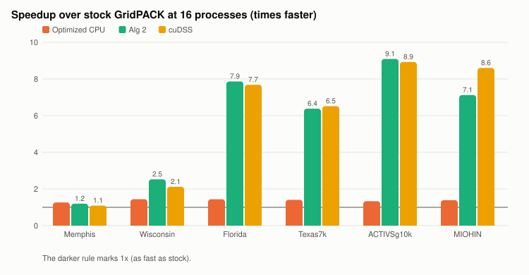
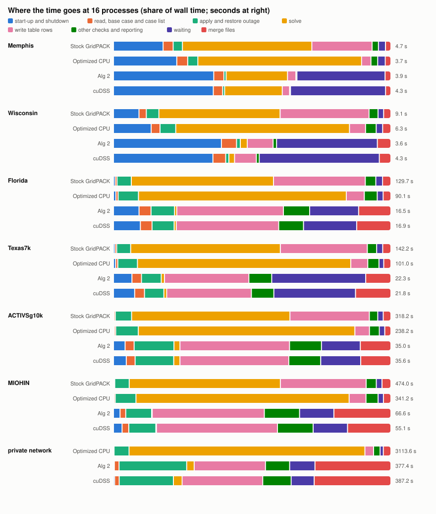
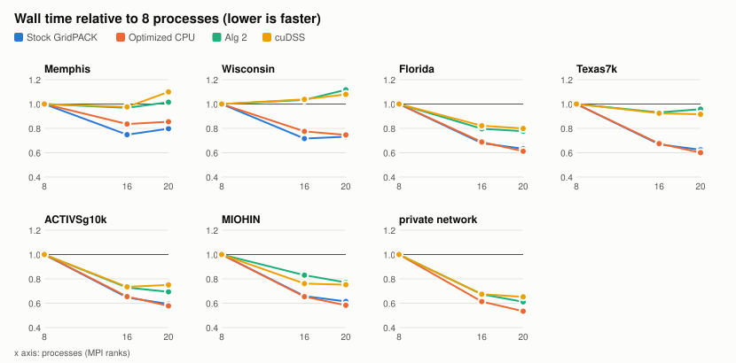
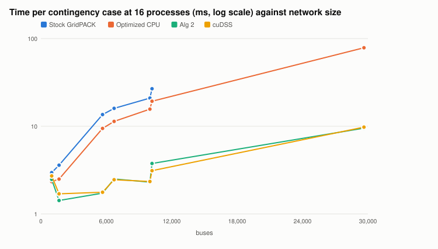
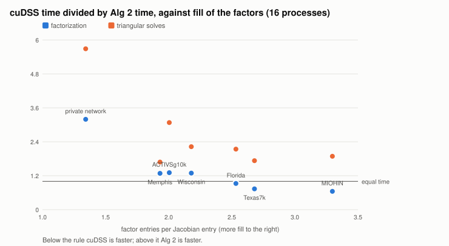

# Test matrix: runtime and accuracy of the four versions

This part reports the measurements behind the comparison of
[01-methodology.md](01-methodology.md): every network, at three process
counts, on the four programs. All numbers come from `matrix/results.jsonl`
and the run folders through `tools/ca_matrix/analyze_matrix.py` and
`compare_runs.py`; the tables they write are in `figures/` next to this
file.

## 1. Questions

1. How much faster is each version than stock GridPACK, and than the
   optimized CPU path, on networks of 1,000 to 30,000 buses?
2. Which stage of the pipeline sets the runtime of each version, and which
   stage accounts for each version's speedup?
3. How do the versions scale with the number of processes and with network
   size?
4. Do the faster versions give the same answers?

## 2. Setup

**Machine.** One NVIDIA DGX Spark: a GB10 chip with 20 Arm cores (10
performance, 10 efficiency), one GPU with 48 multiprocessors (compute
capability 12.1), and 128 GB of memory shared by CPU and GPU (122 GiB visible
to the operating system).

**Programs.** The four programs of 01-methodology §1, built as release
builds (`-O3 -DNDEBUG`) in the same container image with the same libraries
(`tools/ca_matrix/build.sh`), and run in that image with
`mpiexec --bind-to none`.

**Networks.** Every PSS/E file in `matrix/networks`, run smallest file first.

| Network | Buses | Branches | Cases (branch + generator) | Notes |
|---|---:|---:|---:|---|
| Memphis | 993 | 1,338 | 1,570 (1,382 + 188) | |
| Wisconsin | 1,664 | 2,207 | 2,541 (2,462 + 79) | |
| Florida | 5,658 | 7,866 | 9,547 (9,073 + 474) | |
| Texas7k | 6,717 | 8,646 | 8,891 (8,160 + 731) | |
| ACTIVSg10k | 10,000 | 12,217 | 15,191 (12,706 + 2,485) | |
| MIOHIN | 10,192 | 14,721 | 17,700 (17,013 + 687) | |
| Private planning case | 29,636 | 34,267 | 39,628 (34,071 + 5,557) | PSS/E v34, distributed generation and six dc lines; CEII, reported in aggregate only |

Branch counts are GridPACK's branch objects; parallel circuits are one
object but separate outages.

**Input.** Every input file is `test_runs/input.xml` with exactly three
things changed: the solve path (`GPUBatch/enabled` off for the CPU paths,
on with `backend` `alg2` or `cudss`), `outputFile` (the network name) and
`networkConfiguration`. The settings that matter:

| Setting | Value |
|---|---|
| Outages | `FullBranchN1` and `FullGeneratorN1` |
| Newton tolerance, step limit | 1e-4 per unit (0.01 MW at 100 MVA), 50 steps |
| Reactive limits | `qlim` on in both blocks, deadband 0.1, 3 controller passes |
| Ratings, voltage limits | rating C; 0.9 and 1.1 per unit |
| Output | `csv_flat` (one row per branch per solved case), statistics off |
| GPU | batch 512, start from the base case, no shadow re-solves, `onUnavailable = error` |
| Linear solver (CPU) | PETSc with KLU |

**Matrix.** Each network runs at 8, 16 and 20 processes on all four
programs. Each study runs twice and the median is reported; the private
case runs once. The 16-process runs keep their result tables for the
accuracy comparison; all others delete them after timing.

**Isolation.** One study runs at a time. Before each run the harness waits
(up to 10 minutes) until no more than three tasks are runnable on the
machine, and flags runs that start on a busy machine; none was flagged.
Each run is in a container capped at 64 GiB of memory, started only if that
much is available, and its peak memory is sampled every 0.5 s.

**Timing.** Wall time is the whole `mpiexec` run. Stage times come from
GridPACK's own timer (01-methodology §4.3): the stages (read, base case,
case list, case loop, merge) are the slowest process's time; the steps
inside the case loop are the average per process of the time summed over
that process's cases. Two derived parts complete the picture: **waiting**
is case-loop time not in any step (on the GPU paths mostly waiting for
GPU results; on all paths the wait for the last process), and **start-up
and shutdown** is wall time outside every stage (MPI start, GPU and library
start-up, exit).

**Accuracy.** At 16 processes, each version's `csv_flat` table is matched
row by row with the optimized CPU table on (case, from bus, to bus,
circuit), and for branch loading, complex, real and reactive power flow,
bus voltage and bus angle it reports the mean and largest absolute and
percentage difference and the share of rows more than 1% apart. Rows whose
CPU value is exactly zero have no percentage and are counted separately.
The convergence and violation tables are compared case by case.

## 3. Runtime

### 3.1 Whole studies



Wall time at 16 processes (seconds; median of two runs):

| Network | Stock | Optimized CPU | Alg 2 | cuDSS | Optimized CPU vs stock | Alg 2 vs stock | cuDSS vs stock | Alg 2 vs optimized CPU | cuDSS vs optimized CPU |
|---|---:|---:|---:|---:|---:|---:|---:|---:|---:|
| Memphis | 4.65 | 3.67 | 3.89 | 4.26 | 1.27× | 1.20× | 1.09× | 0.94× | 0.86× |
| Wisconsin | 9.14 | 6.35 | 3.62 | 4.31 | 1.44× | 2.53× | 2.12× | 1.76× | 1.47× |
| Florida | 129.72 | 90.14 | 16.49 | 16.88 | 1.44× | 7.87× | 7.68× | 5.47× | 5.34× |
| Texas7k | 142.20 | 101.02 | 22.28 | 21.81 | 1.41× | 6.38× | 6.52× | 4.53× | 4.63× |
| ACTIVSg10k | 318.17 | 238.16 | 35.00 | 35.64 | 1.34× | 9.09× | 8.93× | 6.81× | 6.68× |
| MIOHIN | 474.00 | 341.18 | 66.56 | 55.10 | 1.39× | 7.12× | 8.60× | 5.13× | 6.19× |
| Private case | fails | 3,113.58 | 377.38 | 387.25 | – | – | – | 8.25× | 8.04× |

Every process count is in `figures/wall.csv`. The two repeats of a study
differed by a median of about 1% and at most 13% (stock Memphis at 20
processes, a 5-second study).

- **Optimized CPU** is 1.27–1.56 times faster than stock on every network
  at every process count.
- **The GPU paths** are 6.4–9.1 times faster than stock at 16 processes on
  the four networks above 5,000 buses, and 8.9–10.2 times at 8 processes,
  where stock has fewer processes to share the solves. The largest
  speedups are ACTIVSg10k on Alg 2 at 8 processes (491.6 → 48.0 s, 10.2×)
  and MIOHIN on cuDSS at 8 processes (719.2 → 72.4 s, 9.9×).
- **Small networks gain little.** Memphis is slower on the GPU paths than
  on the optimized CPU path: its whole study takes 4 s, GPU start-up adds
  about 0.6 s, and 174 of its 1,568 GPU cases (11%) diverge on the GPU and
  are solved again on the CPU (§4.1).
- **Stock cannot run the private case.** Its base-case solve aborts after
  2 s, when a solver error message overflows a 128-byte buffer
  (01-methodology §4.4, item 3; the parser defects of §4.5 make that solve
  fail in the first place). On the private case the GPU paths are 7.2–9.0
  times faster than the optimized CPU path: at 8 processes 5,072 s (85
  minutes) becomes 561 s on Alg 2, and at 16 processes 3,114 s becomes
  377 s.

### 3.2 Where the time goes in each version



Seconds per part at 16 processes (case-loop parts are averages per
process):

| Network | Version | Wall | Start-up | Read, base, list | Apply and restore | Solve | Write rows | Other reporting | Waiting | Merge |
|---|---|---:|---:|---:|---:|---:|---:|---:|---:|---:|
| Texas7k | Stock | 142.2 | 0.7 | 0.9 | 7.2 | 76.7 | 44.6 | 4.8 | 3.1 | 4.2 |
| | Optimized CPU | 101.0 | 0.8 | 0.8 | 7.1 | 77.7 | 6.2 | 4.1 | 1.7 | 2.6 |
| | Alg 2 | 22.3 | 1.5 | 0.8 | 1.6 | 0.3 | 6.8 | 1.8 | 7.5 | 2.0 |
| | cuDSS | 21.8 | 1.7 | 0.8 | 1.5 | 0.2 | 6.7 | 1.8 | 6.4 | 2.8 |
| ACTIVSg10k | Stock | 318.2 | 0.7 | 1.4 | 18.7 | 181.6 | 91.1 | 9.6 | 6.3 | 8.8 |
| | Optimized CPU | 238.2 | 0.8 | 1.2 | 19.4 | 185.9 | 12.5 | 8.4 | 4.7 | 5.3 |
| | Alg 2 | 35.0 | 1.5 | 1.1 | 5.0 | 0.8 | 13.8 | 4.0 | 4.9 | 3.9 |
| | cuDSS | 35.6 | 1.6 | 1.1 | 5.0 | 0.8 | 14.0 | 4.1 | 5.1 | 3.9 |
| MIOHIN | Stock | 474.0 | 0.7 | 1.6 | 24.7 | 258.2 | 146.5 | 17.3 | 9.7 | 15.3 |
| | Optimized CPU | 341.2 | 0.7 | 1.4 | 25.6 | 262.1 | 20.7 | 14.9 | 6.6 | 9.2 |
| | Alg 2 | 66.6 | 1.6 | 1.4 | 6.2 | 0.1 | 26.9 | 8.4 | 8.2 | 13.7 |
| | cuDSS | 55.1 | 1.7 | 1.3 | 5.4 | 0.1 | 24.0 | 7.1 | 6.8 | 8.6 |

The private case at 16 processes: optimized CPU 3,113.6 s, of which the
solve is 2,647.1 s (85%); Alg 2 377.4 s, of which row writing is 97.0 s,
applying and restoring outages 92.0 s, the merge 103.3 s and waiting
34.4 s. Its outage step is large because 7,707 of its 39,628 outages split
off radial parts of the grid; GridPACK handles those on the CPU with its
full island search. Its merge writes a table of 1.04 billion rows. All
networks and process counts are in `figures/steps.csv`. On the GPU
paths, "solve" is GridPACK re-solving the cases the GPU could not finish;
the GPU's own work runs alongside the reporting and shows up only as
waiting (§3.5).

**What sets the runtime.**

- **Stock GridPACK:** the Newton solves (51–57% of wall time on networks
  above 5,000 buses) and writing the table rows (29–33%). Applying and
  restoring outages is 5–6%, the merge 3%.
- **Optimized CPU:** the solves alone (75–78%). Row writing falls to 5–7%.
- **GPU paths:** reporting on the CPU processes. Row writing is the largest
  part (30–44% of wall time), followed by waiting for the GPU (12–34%), the
  merge (9–21%), applying and restoring outages (7–14%) and the other
  checks (8–13%). The solve proper is under 2.5% of wall time.

**What each version's speedup comes from.** Seconds saved per part, as a
share of the whole saving, at 16 processes (`figures/savings.csv`):

| Step | Network | Saving (s) | From writing rows | From the solve | From apply and restore | From the merge | Other parts |
|---|---|---:|---:|---:|---:|---:|---:|
| Stock → optimized CPU | Florida | 39.6 | 94% | −3% | 0% | 3% | 5% |
|  | Texas7k | 41.2 | 93% | −2% | 0% | 4% | 5% |
|  | ACTIVSg10k | 80.0 | 98% | −5% | −1% | 4% | 4% |
|  | MIOHIN | 132.8 | 95% | −3% | −1% | 5% | 4% |
| Optimized CPU → Alg 2 | Florida | 73.6 | −1% | 91% | 7% | 1% | 1% |
|  | Texas7k | 78.7 | −1% | 98% | 7% | 1% | −5% |
|  | ACTIVSg10k | 203.2 | −1% | 91% | 7% | 1% | 2% |
|  | MIOHIN | 274.6 | −2% | 95% | 7% | −2% | 1% |
|  | Private case | 2736.2 | 0% | 96% | 3% | −1% | 2% |
| Optimized CPU → cuDSS | Florida | 73.3 | −1% | 92% | 7% | 1% | 1% |
|  | Texas7k | 79.2 | −1% | 98% | 7% | 0% | −4% |
|  | ACTIVSg10k | 202.5 | −1% | 91% | 7% | 1% | 2% |
|  | MIOHIN | 286.1 | −1% | 92% | 7% | 0% | 2% |
|  | Private case | 2726.3 | −1% | 97% | 3% | −1% | 1% |

- **Stock to optimized CPU:** building rows from numbers
  (01-methodology §4.1) accounts for 93–98% of the saving, and the
  multi-process merge (§4.2) for 3–5%. On ACTIVSg10k row writing falls from
  91.1 to 12.5 s per process, and the merge from 8.8 to 5.3 s. The solve
  itself is 1.2–2.4% *slower* than stock's on every network (for example
  181.6 against 185.9 s on ACTIVSg10k). The likely causes are the run-time
  Jacobian-layout check and the distributed generation and dc line terms
  added to GridPACK's per-bus routines (§4.3, §4.5); this was not isolated.
- **Optimized CPU to the GPU paths:** removing the solve accounts for
  91–98% of the saving, and known-topology reporting (§5.7) cuts applying
  and restoring outages from 19.4 to 5.0 s per process on ACTIVSg10k, a
  further 7%. Waiting for GPU results and slightly slower row writing (the
  rows are written in smaller packets) take a few percent back.

### 3.3 Scaling with processes



| Network | Version | 8 → 16 processes | 8 → 20 processes |
|---|---|---:|---:|
| ACTIVSg10k | Stock | 0.65 | 0.59 |
| | Optimized CPU | 0.65 | 0.58 |
| | Alg 2 | 0.73 | 0.69 |
| | cuDSS | 0.73 | 0.75 |
| Texas7k | Stock | 0.67 | 0.62 |
| | Optimized CPU | 0.67 | 0.60 |
| | Alg 2 | 0.93 | 0.96 |
| | cuDSS | 0.92 | 0.92 |

(Ratios of wall time; all networks in `figures/scaling.csv`.)

- **The CPU paths** gain 1.5 times from 8 to 16 processes, not 2: the case
  loop's parallel efficiency is 75–79%. Processes 11 to 20 run on the
  efficiency cores and share memory bandwidth, so going from 16 to 20 adds
  only another 7–12%.
- **The GPU paths** gain less, because the GPU's own work does not shrink
  with more processes. On the four networks above 5,000 buses, at 8
  processes the GPU is busy 36–72% of the case loop, and reporting on the
  CPU processes sets the pace; at 16 and 20 it is busy 54–88% (§3.5), so
  the GPU becomes the limit, most of all on Texas7k (7% faster from 8 to 16
  processes, none after) and MIOHIN.
- **The private case is the exception:** there reporting, not the GPU,
  sets the GPU paths' pace (the GPU is busy 29% of the case loop on Alg 2),
  so they scale almost like the CPU path (0.67 of the 8-process time at 16
  processes, against 0.61).
- **Consequence for speedups:** the GPU paths' advantage over stock is
  largest at 8 processes and shrinks as stock gets more processes. The best
  GPU wall times are reached at 16 to 20 processes.

### 3.4 Scaling with network size



Milliseconds of wall time per case at 16 processes:

| Network | Buses | Stock | Optimized CPU | Alg 2 | cuDSS |
|---|---:|---:|---:|---:|---:|
| Memphis | 993 | 2.96 | 2.34 | 2.48 | 2.71 |
| Wisconsin | 1,664 | 3.60 | 2.50 | 1.42 | 1.70 |
| Florida | 5,658 | 13.59 | 9.44 | 1.73 | 1.77 |
| Texas7k | 6,717 | 15.99 | 11.36 | 2.51 | 2.45 |
| ACTIVSg10k | 10,000 | 20.94 | 15.68 | 2.30 | 2.35 |
| MIOHIN | 10,192 | 26.78 | 19.28 | 3.76 | 3.11 |
| Private case | 29,636 | – | 78.57 | 9.52 | 9.77 |

The CPU paths' time per case grows roughly in proportion to network size
(eight to nine times from Memphis to MIOHIN), because each case's solve and
each case's rows grow with the network. The GPU paths' time per case grows
far more slowly (1.4 to 3.8 ms) because the solve is spread over 512 cases
at once; what grows is the reporting, which is proportional to the number
of branches. The GPU paths' advantage therefore increases with network
size, from none at 1,000 buses to 5–7 times the optimized CPU path at
10,000 buses and 8 times at 30,000 buses.

### 3.5 Inside the GPU engine

At 16 processes (from each run's log; `figures/gpu.csv`):

| Network | Cases on the GPU | Cases on the CPU (islanded) | GPU cases retried on the CPU | Slot occupancy | GPU busy, Alg 2 | GPU busy, cuDSS | Share of case loop the GPU is busy, Alg 2 / cuDSS |
|---|---:|---:|---:|---:|---:|---:|---:|
| Memphis | 1,568 | 2 | 174 | 32% | 0.7 s | 0.9 s | 30% / 36% |
| Wisconsin | 2,462 | 79 | 23 | 25% | 1.1 s | 1.5 s | 57% / 64% |
| Florida | 9,379 | 168 | 7 | 72% | 8.0 s | 8.9 s | 65% / 71% |
| Texas7k | 8,807 | 84 | 3–4 | 55% | 14.8 s | 13.4 s | 82% / 81% |
| ACTIVSg10k | 14,590 | 601 | 10 | 67% | 15.5 s | 24.3 s | 54% / 84% |
| MIOHIN | 17,628 | 72 | 2 | 91% | 40.8 s | 32.7 s | 82% / 75% |
| Private case | 31,920 | 7,708 | 52 / 49 | 79% | 77.5 s | 242.1 s | 29% / 89% |

- **Coverage.** 96–99.9% of cases run on the GPU on the public networks
  and 81% on the private case. The rest are outages that split the grid
  into islands, which GridPACK reports without solving, on every path
  alike (and one private-case outage that cuts off the reference bus).
- **Retries.** Cases that diverge on the GPU are solved again by GridPACK
  from GridPACK's own start. Almost all diverge there too: of the 220 such
  cases on Alg 2 over the six networks, 217 diverge again and three converge
  (one of them the Memphis case of §4.4); cuDSS has 218 retries, of which
  217 diverge again and one (ACTIVSg10k) solves with an overloaded slack.
  Retries cost CPU time; they are how the GPU paths keep GridPACK's
  outcomes.
- **Occupancy** is low on small networks because a whole study fits in a few
  batches and the last batch empties as its slowest cases finish.
- **Alg 2 against cuDSS.** The GPU time is mostly factorization. Which
  method factorizes faster depends on how much the factors fill in:

  

  | Network | Fill (factor entries per Jacobian entry) | Levels | Factorization, Alg 2 / cuDSS (s) | Triangular solves, Alg 2 / cuDSS (s) | Wall, Alg 2 / cuDSS (s) |
  |---|---:|---:|---:|---:|---:|
  | Private case | 1.34 | 202 | 40.64 / 129.84 | 15.97 / 90.83 | 377.38 / 387.25 |
  | Memphis | 1.93 | 122 | 0.43 / 0.55 | 0.17 / 0.28 | 3.89 / 4.26 |
  | ACTIVSg10k | 2.00 | 356 | 10.96 / 14.32 | 2.60 / 8.01 | 35.00 / 35.64 |
  | Wisconsin | 2.18 | 178 | 0.75 / 0.98 | 0.22 / 0.48 | 3.62 / 4.31 |
  | Florida | 2.53 | 336 | 6.07 / 5.62 | 1.19 / 2.56 | 16.49 / 16.88 |
  | Texas7k | 2.68 | 502 | 11.73 / 8.61 | 2.27 / 3.93 | 22.28 / 21.81 |
  | MIOHIN | 3.30 | 444 | 33.90 / 21.93 | 4.36 / 8.24 | 66.56 / 55.10 |

  On the four networks whose factors hold 2.2 or fewer entries per
  Jacobian entry, cuDSS's factorization takes 28–31% longer than Alg 2's,
  and 3.2 times as long on the private case, whose factors are the
  sparsest (1.34); on the three with 2.5 or more, it takes 7–35% less
  time. A plausible reason is that denser factors contain larger dense
  blocks, which cuDSS's library kernels handle well, while Alg 2 does one
  sparse update per thread. Alg 2's triangular solves are 1.7–5.7 times
  faster on every network. In wall time the two are within 3% on Florida,
  Texas7k, ACTIVSg10k and the private case, where reporting hides the
  difference (on the private case the GPU is busy 77 s of a 377 s study on
  Alg 2 and 242 s of 387 s on cuDSS); Alg 2 is 9–19% faster on Memphis and
  Wisconsin, where cuDSS's longer set-up counts; and cuDSS is 17% faster
  on MIOHIN. This suggests choosing the method from the planner's fill
  ratio, which is known before the first case is solved.

### 3.6 Memory

The processes' own memory (excluding the operating system's file cache)
peaked at 8.5 GB on the public networks (ACTIVSg10k, 20 processes, Alg 2)
and at 40.0 GB on the private case (20 processes, Alg 2; cuDSS 22.1 GB,
optimized CPU 13.8 GB). The GPU paths need more because each of the 512
slots holds a copy of the Jacobian and its factors. Including file cache,
the containers reached 47.5 GB on ACTIVSg10k and the full 64 GiB cap on
the private case, whose output tables are larger than memory; the cache is
released under pressure, and no run was stopped for memory.

## 4. Accuracy

### 4.1 Case outcomes and Newton steps

At 16 processes every version gives every case of Wisconsin, Florida,
Texas7k, ACTIVSg10k, MIOHIN and the private case the same outcome
(converged, diverged, islanded, slack overload):

| Network | Converged | Slack overload | Islanded | Diverged | Mean Newton steps, CPU paths | Mean Newton steps, GPU paths |
|---|---:|---:|---:|---:|---:|---:|
| Memphis | 1,390 (stock 1,389) | 5 | 1 | 174 (stock 175) | 2.26 (stock 2.23) | 2.20 |
| Wisconsin | 2,416 | 23 | 79 | 23 | 1.88 | 1.87 |
| Florida | 9,304 | 68 | 168 | 7 | 1.83 | 1.83 |
| Texas7k | 8,639 | 166 | 82 | 4 | 1.93 | 1.88 |
| ACTIVSg10k | 12,222 | 2,360 | 599 | 10 | 2.07 | 1.84 |
| MIOHIN | 17,052 | 574 | 72 | 2 | 1.78 | 1.78 |
| Private case | 31,839 | 35 | 7,707 | 47 | 1.01 (no stock) | 1.00 |

Converged cases take a median of two Newton steps and at most six on
every path, apart from one Memphis case (§4.4). The GPU paths take slightly
fewer steps on ACTIVSg10k and Texas7k because they start from the solved
base case instead of the file's voltages. The private case's file holds a
solved state, so most of its cases converge in one step on every path.

### 4.2 Branch flows, loading and bus voltages

Largest absolute difference from the optimized CPU path over all matched
rows at 16 processes (`figures/accuracy.csv` has the mean and percentage
differences too). The table prints flows to 0.0001, so 0.0001 is one
printed digit.

| Network | Version | Rows compared | Loading (% points) | Complex power (MVA) | Real power (MW) | Reactive power (MVAr) | Voltage (pu) | Angle (degrees) | Largest share of rows more than 1% off |
|---|---|---:|---:|---:|---:|---:|---:|---:|---:|
| Memphis | Alg 2 | 1,861,158 | 0.0100 | 0.0058 | 0.0007 | 0.0118 | 0.0000 | 0.0007 | 0.0001% |
| Memphis | cuDSS | 1,861,158 | 22.0600 | 50.5881 | 13.3659 | 68.3516 | 0.1440 | 3.8329 | 0.0105% |
| Memphis | Stock | 1,859,820 (+1,338 only on optimized CPU) | 0.0000 | 0.0001 | 0.0000 | 0.0000 | 0.0000 | 0.0000 | 0.0000% |
| Wisconsin | Alg 2 | 5,334,319 | 0.0000 | 0.0000 | 0.0000 | 0.0000 | 0.0000 | 0.0000 | 0.0000% |
| Wisconsin | cuDSS | 5,334,319 | 0.0000 | 0.0000 | 0.0000 | 0.0000 | 0.0000 | 0.0000 | 0.0000% |
| Wisconsin | Stock | 5,334,319 | 0.0000 | 0.0000 | 0.0000 | 0.0000 | 0.0000 | 0.0000 | 0.0000% |
| Florida | Alg 2 | 73,165,215 | 0.0000 | 0.0001 | 0.0001 | 0.0000 | 0.0000 | 0.0000 | 0.0000% |
| Florida | cuDSS | 73,165,215 | 0.0000 | 0.0000 | 0.0001 | 0.0000 | 0.0000 | 0.0000 | 0.0000% |
| Florida | Stock | 73,165,215 | 0.0000 | 0.0000 | 0.0001 | 0.0000 | 0.0000 | 0.0000 | 0.0000% |
| Texas7k | Alg 2 | 74,701,440 | 0.0000 | 0.0001 | 0.0001 | 0.0000 | 0.0000 | 0.0000 | 0.0000% |
| Texas7k | cuDSS | 74,701,440 | 0.0000 | 0.0001 | 0.0001 | 0.0001 | 0.0000 | 0.0001 | 0.0000% |
| Texas7k | Stock | 74,701,440 | 0.0000 | 0.0001 | 0.0001 | 0.0000 | 0.0000 | 0.0000 | 0.0000% |
| ACTIVSg10k | Alg 2 | 149,328,391 | 0.0000 | 0.0001 | 0.0001 | 0.0001 | 0.0000 | 0.0001 | 0.0000% |
| ACTIVSg10k | cuDSS | 149,328,391 | 0.0000 | 0.0001 | 0.0001 | 0.0001 | 0.0000 | 0.0001 | 0.0000% |
| ACTIVSg10k | Stock | 149,328,391 | 1.3700 | 1.7759 | 0.1988 | 4.7627 | 0.0222 | 0.1389 | 0.0001% |
| MIOHIN | Alg 2 | 250,679,100 | 0.0000 | 0.0001 | 0.0001 | 0.0001 | 0.0000 | 0.0001 | 0.0000% |
| MIOHIN | cuDSS | 250,679,100 | 0.0000 | 0.0001 | 0.0001 | 0.0001 | 0.0000 | 0.0001 | 0.0000% |
| MIOHIN | Stock | 250,679,100 | 0.0000 | 0.0001 | 0.0001 | 0.0001 | 0.0000 | 0.0001 | 0.0000% |
| Private case | Alg 2 | 1,040,117,280 | 0.2200 | 0.0646 | 0.0118 | 0.1047 | 0.0005 | 0.0040 | 0.0000% |
| Private case | cuDSS | 1,040,117,280 | 0.2200 | 0.0646 | 0.0118 | 0.1047 | 0.0005 | 0.4856 | 0.0000% |

- **Mean differences** are 0.0000 (to four decimals) for every variable,
  network and version.
- **Alg 2 and cuDSS against optimized CPU, public networks.** On Wisconsin,
  Florida, Texas7k, ACTIVSg10k and MIOHIN the largest difference in any
  flow, voltage or angle is one printed digit (0.0001). On Memphis, Alg 2
  differs by at most 0.012 MVAr and 0.01 percentage points of loading,
  within the 0.01 MW (1e-4 per unit) tolerance at which the solve stops,
  because the GPU starts from the base case; cuDSS differs by much more,
  all of it in one case (§4.4).
- **Private case.** 1.04 billion rows. Both GPU paths differ from the
  optimized CPU path in only three of its 39,628 outages, identically on
  both, on 7 to 13 branches each: at most 0.065 MVA of flow, 0.22
  percentage points of loading and 0.0005 per unit of voltage. All three
  cases converge on every path but go through two to four reactive-limit
  and dc line controller passes, and the GPU (starting from the base case)
  and the CPU (starting from the file) end those passes at slightly
  different points within the tolerance, as the planning-case validation
  also found for two dc outages (`WECC_COMPATIBILITY.md` §8.5). The 0.49°
  angle on cuDSS is on a bus the outage disconnects: its voltage is zero
  on every path, so its angle is meaningless, and its flows agree exactly.
- **Stock against optimized CPU.** Identical on Wisconsin, Florida, Texas7k
  and MIOHIN, apart from one printed digit. On ACTIVSg10k stock differs by
  up to 0.022 per unit of voltage and 1.37 percentage points of loading in
  a few late cases: this is the voltage-setting leak between cases that the
  optimized versions correct (01-methodology §4.4, item 1), with the same
  0.022 per unit size first measured in `restoration.md`. On Memphis stock
  lacks the 1,338 rows of the case it reports diverged (§4.4).
- **Rows more than 1% off:** at most 0.0001% of rows everywhere except
  Memphis on cuDSS (0.01%, the one case). Rows whose CPU value is zero
  (for example the loading of branches without a rating C) have no
  percentage and are counted separately in `accuracy.csv`.

### 4.3 Violations

The violation tables (every overloaded branch and out-of-range voltage of
every case, with its severity) are identical, entry for entry and severity
for severity, on all four versions for Wisconsin, Florida, Texas7k,
ACTIVSg10k and MIOHIN (5,950, 398, 17,647, 325 and 136,734 entries), and on
the three optimized versions for the private case (4,618,282 entries). On
Memphis, Alg 2 matches the optimized CPU path exactly; stock lacks 17
entries and cuDSS has 135 more, all from the one case of §4.4.

### 4.4 The one case that differs

Memphis case 1068 (the outage of branch 33–34) has no clean solution at
this tolerance. In every version the largest mismatch falls from 1.2 to
about 1e-4 per unit in four Newton steps and then circles that value at
one bus without settling (on stock it stays between 1.0e-4 and 2.2e-3
from step 4 to step 49). Whether and when a step lands below 1e-4 then
depends on rounding:

| Version | Outcome | Newton steps | Final mismatch (pu) |
|---|---|---:|---:|
| Stock | diverged (50-step limit) | 50 | 9.975e-5 |
| Optimized CPU | converged | 44 | 9.958e-5 |
| Alg 2 | diverged on the GPU at 50 steps; GridPACK's re-solve gives the optimized CPU result | 50 + 44 | 9.958e-5 |
| cuDSS | converged on the GPU | 47 | 9.912e-5 |

Running this case alone (`matrix/probe_1068`) gives the same four
outcomes, so it does not depend on the order of cases. The stock and
optimized CPU traces agree to seven digits for twelve steps and first
differ in the seventh digit at step 13, a rounding-level difference,
most likely from the optimized build's changed per-bus demand arithmetic
(distributed generation and converter terms, 01-methodology §4.5); it was
not traced further. The state at whichever step happens to land below
the tolerance is reported, so cuDSS
reports bus voltages up to 0.144 per unit away from the optimized CPU
path's and 135 more violations. None of these outcomes is more correct
than the others. A case that needs 44–50 steps instead of two is close to
having no solution, and a convergence check that looked at the trend of the
mismatch, not only its last value, would flag it on every version.

## 5. Summary of trends

1. **Reporting was the hidden cost of stock GridPACK.** About a third of a
   stock study is spent building and writing table rows; removing that is
   all of the optimized CPU path's 1.3–1.6× speedup.
2. **The GPU removes the solve, and reporting becomes the limit.** At 16
   processes the solve proper is under 2.5% of a GPU-path study; row writing
   is 30–44%. Further speed must come from reporting and output, not from
   the GPU.
3. **Speedup grows with network size and shrinks with process count.**
   Small networks (under 2,000 buses) gain at most 3.7×; networks of
   5,000–10,000 buses gain 6–10× over stock. More processes help stock more
   than the GPU paths, because the GPU's work does not divide among them.
4. **Alg 2 and cuDSS are close in practice; fill decides the winner.** Their
   wall times are within 3% on three of the four large networks; Alg 2
   factorizes faster when the factors are sparse, cuDSS when they fill in.
5. **Answers are the same.** Apart from one ill-conditioned Memphis case,
   every version gives every case the same outcome and the same violation
   table, and flows and voltages agree with the optimized CPU path to one
   printed digit (0.0001) on the public networks above 1,000 buses, within
   the solver tolerance on Memphis (Alg 2), and within 0.065 MVA and
   0.0005 per unit on the 1.04 billion rows of the private case.

## 6. Limits of these measurements

- One machine. The GB10 shares memory between CPU and GPU; a discrete GPU
  would add transfer costs, and a server CPU would change the CPU paths'
  scaling.
- Two runs per study (one for the private case). Run-to-run differences
  were about 1% (§3.1), small next to the effects reported.
- One input configuration. Studies with switched shunts, tap changers or
  area interchange run entirely on the CPU path (01-methodology §5.2) and
  were not measured. The `csv_delta` output writes twice the bytes per row
  and would raise reporting's share further.
- The GPU paths start each case from the base case and the CPU paths from
  the file; this changes step counts slightly (§4.1), as it would in use.

## 7. Reproducing these numbers

```sh
tools/ca_matrix/build.sh                       # both programs, release builds
tools/ca_matrix/run_campaign.sh                # every network, 8/16/20 processes, 4 versions
tools/ca_matrix/run.sh "python3 /src/tools/ca_matrix/compare_runs.py"   # accuracy at 16
python3 tools/ca_matrix/matrix_report.py --csv matrix/report.csv          # step times
python3 tools/ca_matrix/analyze_matrix.py      # tables and figures in matrix/analysis
```
